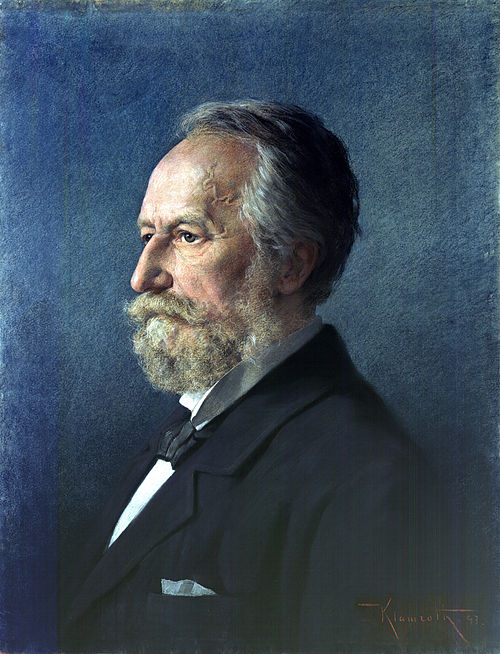
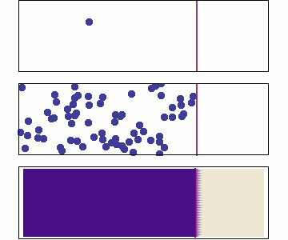

::: {.content-visible when-format="html" unless-format="revealjs"}

::: {.callout-note}
- Slides 👉  [Open presentation🗒️](./slides.html)
- PDF version of course note  👉 [Open in pdf](./L02.pdf)
- Handwritten notes 👉 [Open in pdf](./public/L02_annotated.pdf)
:::

:::

## Recap

- Fick's 1st law of diffusion
$$
J_{Az}^{*} = -D_{AB}\dfrac{d c_A}{dz}
$$

- Diffusion and convection
$$
N_{A} = J_{Az}^{*} + c_A v_m
$$

- **Governing equation** for binary mixture system
$$
N_{A} = -c_T D_{AB} \dfrac{d x_A}{dz} + x_A(N_A + N_B)
$$

- We will learn how to solve this equation in this lecture!

---

## Learning outcomes {.center}

After this lecture, you will be able to:

- **Recall** the difference between diffusion and convection mechanisms in binary mixtures.
- **Identify** common transport cases from the relation between $N_A$ and $N_B$.
- **Describe** the governing constraint for a given gas-diffusion setup.
- **Apply** flux equations for equimolar counter diffusion and diffusion through stagnant B.
- **Analyze** how the stagnant-B assumption changes concentration profiles and driving forces.


--- 

## Recap: Fick's 1st law of diffusion

Diffusion flux of A in B, z-direction follows:

$$
J^*_{Az} = - D_{AB}\,\frac{d c_A}{d z}
$$

::: {.columns}
::: {.column width="20%"}
{fig-alt="Adolf Fick"}

:::

::: {.column width="80%"}
- Fick was the first to propose the relation between diffusion and concentration gradient driving force
- Analog:
  - Heat transfer (**Fourier's law**)
  - Momentum transfer in fluid (**Newton equation**)
- Diffusivity $D_{AB}$ was later linked to molecular Brownian motion by Albert Einstein
- $D_{AB}$ has unit of $\mathrm{m^2\,s^{-1}}$
:::
:::

---

## Behaviour of molecular diffusion

:::: {.columns}

::: {.column width="40%"}

::: {.content-visible when-format="html"}
{width="95%"}
:::

:::

::: {.column width="60%"}
- Brownian motion (Bm) is the inherent motion of molecules
- Bm leads to redistribution of molecules until $\dfrac{d c_A}{d z} = 0$
- Non-zero flux only when $\dfrac{d c_A}{d z} \neq 0$
- Is diffusivity temperature dependent? pressure dependent?
- How fast is molecular diffusion?
:::

:::: 

---

## Typical $D_{AB}$ range

```{=html}
<iframe width="100%" height="800"
		src="../../scripts/L02_diffusivity_demo.html" title="Webpage example"></iframe>
```


## A common misconception

Search for any youtube video with *"diffusion experiment dye"*

[Example Video](https://www.youtube.com/embed/STLAJH7_zkY){preview-link="true"}

Can we **verify** whether the scenario seen is Ficknian diffusion?

---

## Diffusion vs convection length scale

:::: {.columns}

::: {.column width="45%"}
Length $L$ traveled in time $t$:

- **Diffusion:** $L = 6\sqrt{D_{AB}\,t}$ *(Einstein, ~1905)*
- **Convection:** $L = v_m\,t$

**What is typical $D_{AB}$ in a liquid?**  
- Often $D_{AB}\sim 10^{-9}$ to $10^{-10}\,\mathrm{m^2/s}$
:::

::: {.column width="55%"}
Assuming $D_{AB} = 10^{-10} \mathrm{m^2/s}$
$v_{m} = 10^{-3} \mathrm{m/s}$

```{=html}
<iframe width="100%" height="800"
		src="../../scripts/L02_diffusion_length.html" title="Webpage example"></iframe>
```
:::

::::

---


## Diffusion vs convection summary

::: columns
::: column
**Diffusion**

- Driven by concentration gradient
- Associated with Diffusivity $D_{AB}$
- Diffusive velocity $v_{Ad}$
- **Slow** at large (industry) length scale

:::
::: column
**Convection**

- Driven by bulk motion 
- Can reinforce or oppose diffusion
- Bulk fluid motion $v_m$
- **Fast** at large (industry) length scale
:::
:::


---

## A note on setups

##### Reference frame
- $J_{Az}^{*}$ refers to the fluid plane frame (hence the $*$)
- $N_{A}$ refers to the stationary frame (lab frame)
- We will be dealing with $N_A$ in this course!

##### Mass balance in stationary frame
$$
[\mathrm{In}] - [\mathrm{Out}] + [\mathrm{Generate}] = [\mathrm{Accumulation}]
$$

##### Steady state (S.S)
- $[\mathrm{Generate}] = [\mathrm{Accumulation}] = 0$
- $[\mathrm{In}] = [\mathrm{Out}]$
- $\dfrac{d N_A}{dz} = 0$ (**S.S**)

---

## Governing equation for $N_A$ and $N_B$

The common way of expressing the governing equation is

```{=tex}
\begin{align}
  N_{A} &= -c_T D_{AB} \dfrac{d x_A}{dz} + x_A(N_A + N_B) \\
  N_{B} &= -c_T D_{BA} \dfrac{d x_B}{dz} + x_B(N_A + N_B) 
\end{align}
```

How can we solve these?

- For this course we assume $D_{AB}$ and $D_{BA}$ are constants
- For industrial purposes we want to know values of $N_A$ and $N_B$
- We need relation between $N_A$ and $N_B$ to solve them!
- $x_A(z)$ can be solved as a by-product


---

## Three limiting cases

:::: {.columns}

::: {.column width="40%"}
Equimolar Counter Diffusion (EMCD)

**Assumption**

- $N_A + N_B = 0$
- $v_m = 0$

**Example**

- Two gases exchanging through a thin tube
- Idealized membrane diffusion
:::

::: {.column width="30%"}
Diffusion with Stagnant B

**Assumption**

- $N_B = 0$
- $N_A \neq 0$

**Example**

- Evaporation of A through non-diffusing air
- Gas absorption into a liquid film
:::

::: {.column width="30%"}
General Case

**Assumption**

- $N_A \neq 0$
- $N_A = k N_B$ ($k \neq -1$)

**Example**

- Catalyst reaction
:::

:::: 

--- 

## Case 1: equimolar counter diffusion (EMCD)

- Condition: $N_A + N_B = 0$
- No bulk fluid motion

```{=tex}
\begin{align}
  N_A &= -N_B \\
      &= J_{Az}^{*} \\
      &= -c_T D_{AB} \dfrac{d x_A}{d z}
\end{align}
```

Relation in EMCD gives:
```{=tex}
\begin{align}
  c_T D_{BA} \dfrac{d x_B}{d z}    &= -c_T D_{AB} \dfrac{d x_A}{d z}
\end{align}
```

Since $x_A + x_B = 1$, we have $D_{AB} = D_{BA}$

---

## Solving EMCD: flux $N_A$

Assume S.S., constant $D_{AB}$ and integrate from $z_1$ to $z_2$

```{=tex}
\begin{align}
\int_{c_{A1}}^{c_{A2}} d c_A
&= -\frac{N_A}{D_{AB}} \int_{z_1}^{z_2} d z \\
c_{A2} - c_{A1} &= -\frac{N_A}{D_{AB}}(z_2 - z_1) \\
\end{align}
```

```{=tex}
\begin{align}
\boxed{
N_A = \frac{D_{AB}}{(z_2 - z_1)}(c_{A1} - c_{A2})
  }
\end{align}
```

For ideal gas:

```{=tex}
\begin{align}
\boxed{
N_A = \frac{D_{AB}}{RT(z_2 - z_1)}(p_{A1} - p_{A2})
  }
\end{align}
```


## Case 2: diffusion through stagnant B

Definition: **stagnant** species B means zero molar flux in the lab frame:
$$
N_B = 0
$$

But diffusion in B phase **still occurs**!

The governing equation becomes:

```{=tex}
\begin{align}
  N_A &= -c_TD_{AB}\dfrac{d x_A}{dz} + x_A N_A \\
  N_A(1 - x_A) &= -c_TD_{AB}\dfrac{d x_A}{dz}
\end{align}
```

## Solving stagnant B case

We again do an integration by separating variables:

```{=tex}
\begin{align}
\frac{d x_A}{1-x_A} &= -\frac{N_A}{c_TD_{AB}}\,dz \\
\int_{x_{A1}}^{x_{A2}} \frac{d x_A}{1-x_A}
&= -\frac{N_A}{c_TD_{AB}}\int_{z_1}^{z_2} dz \\
\left[-\ln(1-x_A)\right]_{x_{A1}}^{x_{A2}}
&= -\frac{N_A}{c_TD_{AB}}(z_2-z_1) \\
\ln\!\left(\frac{1-x_{A1}}{1-x_{A2}}\right)
&= -\frac{N_A}{c_TD_{AB}}(z_2-z_1)
\end{align}
```

```{=tex}
\begin{align}
\boxed{
N_A = \frac{c_TD_{AB}}{(z_2-z_1)}
\ln\!\left(\frac{1-x_{A2}}{1-x_{A1}}\right)
  }
\end{align}
```

---

## Various forms of stagnant B solution

- In concentration and molar fraction

```{=tex}
\begin{align}
N_A = \frac{c_TD_{AB}}{(z_2-z_1)}
\ln\!\left(\frac{1-x_{A2}}{1-x_{A1}}\right)
\end{align}
```

- Ideal gas with partial pressure

```{=tex}
\begin{align}
N_A = \frac{p_TD_{AB}}{RT(z_2-z_1)}
\ln\!\left(\frac{p_T-p_{A2}}{p_T-p_{A1}}\right)
\end{align}
```

--- 

## Log-mean form

Historically, engineers liked to write the stagnant B equation using linear terms.

```{=tex}
\begin{align}
  \ln\!\left(\frac{p_T-p_{A2}}{p_T-p_{A1}}\right) &= \ln\!\left(\frac{p_{B2}}{p_{B1}}\right) \\
  (p_{B2} - p_{B1})\ln\!\left(\frac{p_T-p_{A2}}{p_T-p_{A1}}\right) &= \ln\!\left(\frac{p_{B2}}{p_{B1}}\right) (p_{A1} - p_{A2}) \\
  \ln\!\left(\frac{p_T-p_{A2}}{p_T-p_{A1}}\right)
                                                  &= \ln\!\left(\frac{p_{B2}}{p_{B1}}\right)
                                                    \left(
                                                    \frac{p_{A1} - p_{A2}}{p_{B2} - p_{B1}}
                                                    \right)
\end{align}
```

Define $p_{Bm} = \dfrac{p_{B2} - p_{B1}}{\ln\!(p_{B2}/p_{B1})}$

We get

```{=tex}
\begin{align}
N_A = \frac{D_{AB}}{RT(z_2-z_1)}
  \frac{p_T}{p_{Bm}}(p_{A1}-p_{A2})
\end{align}
```

---

## Solving concentration profiles in stagnant B

- We will utilize the fact $d N_A / dz = 0$ (S.S). 
- Do we have $d c_A / dz = 0$ like in EMCD?

```{=tex}
\begin{align}
d N_A / dz &= -cD_{AB} \frac{d}{dx}
             \left[\frac{1}{1 - x_A}\frac{d x_A}{dz}\right]  \\
           &= 0 \\
\frac{1}{1 - x_A}\frac{d x_A}{dz} &= \mathrm{Const}  \\
  \int_{x_{A1}}^{x} \frac{1}{1 - x_A^{'}}d x_A^{'}
  &= \int_{z_1}^{z} \mathrm{Const}\, dz^{'}
\end{align}
```

*Can you solve the profile for $x_A(z)$*?


---

## Summary

- Choosing the right transport constraint is the key first step in solving binary diffusion problems.
- Equimolar counter diffusion leads to linear concentration and partial-pressure profiles.
- Diffusion through stagnant B produces non-linear profiles and a logarithmic driving-force form.
- The statement "stagnant B" means $N_B = 0$, not "no diffusion."

**Next lecture:** we remove simplifying constraints and discuss the **general case**
