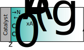
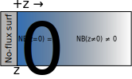

::: {.content-visible when-format="html" unless-format="revealjs"}

::: {.callout-note}
- Slides 👉  [Open presentation🗒️](./slides.html)
- PDF version of course note  👉 [Open in pdf](./L10.pdf)
- Handwritten notes 👉 [Open in pdf](./public/L10_annotated.pdf)
:::

:::

## Midterm exam announcement {.center}

- Date: Feb 09, 2026 (Monday)
- Time: 50 min during class
- Question types:
  - Multichoice questions (conceptual, no derivation)
  - Short-answer questions (conceptual, no derivation)
  - Long-answer questions (derivation and / or calculation)
- Formula sheet / calculator policy: refer to course syllabus

## Midterm exam questions {.center}

- Covers up to unsteady state mass transport
- Sample questions to be released this week on Canvas
- Use our [AI helper](https://gemini.google.com/gem/f2d47200f0bf) wisely!

## Recap {.center}

- Unsteady state mass transfer: $\partial c_A/\partial t \neq 0$
  - **Mass balance equation**: [In] - [Out] + [Gen] = [Acc]
  - **Flux equation**: $N_A = J_{Az}^{*} + c_A/c_T * (N_A + N_B)$
- General expression for U.S.S. M.T. in 3D vector
- Boundary conditions and initial conditions


## Learning outcomes {.center}

After this lecture, you will be able to:

- **Recall** the steps used to formulate unsteady-state mass balances.
- **Identify** boundary and initial conditions for typical 1D mass transfer problems.
- **Apply** coupled balance-and-flux equations to transient diffusion examples.
- **Describe** time-dependent concentration profiles in unsteady-state systems.


## B.C. case 1. concentration at surfaces

{width="55%"}

- Interface can be gas|liquid, liquid|solid, gas|solid
- Often assuming equilibrium

$$
c_{A}\vert_{\text{surf}} = c_{As}\qquad\text{eq. solubility}
$$

## B.C. case 2: chemical reactions

{width="55%"}


```{=tex}
\begin{align}
N_A\big|_{\text{surf}} = \nu_A\, r_A
\end{align}
```

- Surface reaction couples mass transfer and kinetics
- Molar flux at surface determined by reaction rate
- Generally Neumann boundary
- $\nu_A$: stoichiometric ratio

## B.C. case 3: constant flux

{width="55%"}

- In many cases the flux $N_{A, \text{surf}}$ or $N_{B, \text{surf}}$ can be constant.
- E.g. inpenetratable surface to stagnant gas $N_{B, \text{surf}} = 0$
- **Does not** mean $N_{A}(z)$ or $N_B(z)$ elsewhere is constant!

## U.S.S example 1: diffusion through stagnant B

We have seen in previous examples how to solve the molar flux of
liquid evaporating into stagnant air. Let's see the same system but in unsteady state.

**Question**: liquid (A) evaporates inside stagnant air (B)
inside a vertical tube at constant temperature $T$ and pressure
$p_T$. At the vent of the system dry air is continuous blown. Plot the
molar fraction $x_A$ as a function of $z$ and time $t$. Assume the liquid level is $L$ away from the vent and does not change during the evaporation process.

## Step 1: species mass balance (unsteady, 1D)

For a differential slice $A\,dz$, write the mass balance

```{=tex}
\begin{align}
\text{[IN]} - \text{[OUT]} &= \text{[ACC]} \\
A N_A \vert_{z=z} - A N_A \vert_{z=z+\Delta z}
&= \frac{\partial}{\partial t}\left(A\,dz\,c_A\right) \\
-\frac{\partial N_A}{\partial z} = \frac{\partial c_A}{\partial t}
\end{align}
```

We would have $\frac{\partial c_B}{\partial t} = -\frac{\partial N_B}{\partial z}$

## Step 2: couple with flux equation

This is a diffusion through stagnant B case, we can directly write

```{=tex}
\begin{align}
N_A(z, t) = -c_T D_{AB}\frac{\partial x_A(z, t)}{\partial z} + x_A \left[N_A(z, t) + N_B(z, t)\right]
\end{align}
```

- Can we use $N_B=0$ in this case?
- **No**, $N_B$ changes by $z, t$!
- $N_B=0$ only at $z=0$ (liquid interface)
- **Do not** write the steady state $N_A$ solution!

## Step 3: conservation equations

Generally, we still need to know the relation between $N_A$ and $N_B$
to solve the mass-balance-flux equations.

The total concentration $c_T=c_A + c_B$ is conserved, therefore we have constraints

```{=tex}
\begin{align}
\text{[In]}_{T} - \text{[Out]}_{T} &= 0 \\
\text{[In]}_A - \text{[Out]}_A &= -\text{[In]}_B + \text{[Out]}_B \\
\frac{\partial N_A(z, t)}{\partial z} &= -\frac{\partial N_B(z, t)}{\partial z}
\end{align}
```

## Step 4: boundary conditions

Boundary conditions (Left, Right, any time)

- $x_A(0, t) = x_{A0}$ (equilibrium vapor fraction)
- $x_A(L, t) = 0$      (dry air)
- $N_B(0, t) = 0$  (No-flux boundary for B)

The last B.C for $N_B(0, t)$ gives:
```{=tex}
\begin{align}
N_A(0, t) = -\frac{c_T D_{AB}}{1 - x_{A0}}\frac{\partial x_A(0, t)}{\partial z}
\end{align}
```

## Step 5: final solution

- Unsteady state flux equation (stagnant B)

```{=tex}
\begin{align}
N_A = -c_T D_{AB} \frac{\partial x_A}{\partial z}
+ x_A \left[ \frac{-c_T D_{AB}}{1 - x_{A0}} \frac{\partial x_{A}}{\partial z}\big\vert_{z=0} \right]
\end{align}
```

- Governing equation for diffusion through stagnant B, unsteady state:

```{=tex}
\begin{align}
\frac{\partial x_A}{\partial t}
= D_{AB} \frac{\partial^2 x_A}{\partial z^2}
+ \left[ \frac{D_{AB}}{1 - x_{A0}} \frac{\partial x_{A}}{\partial z}\big\vert_{z=0} \right] \frac{\partial x_A}{\partial z} 
\end{align}
```

- Analytical solution exists, but numerical solution is more convenient

## U.S.S diffusion through stagnant B: analytical solution

$x_A{z, t}$ has an analytical solution if $L \rightarrow \infty$ (See Bird. _Transport Phenomena_ Ch 20.1):
```{=tex}
\begin{align}
x_A(z, t)
= x_{A0}
\frac{1 - \operatorname{erf}\!(\frac{z}{\sqrt{4 D_{AB} t}} - \phi)}{1 + \operatorname{erf}\!\phi}
\end{align}
```

$\operatorname{erf}$ is the **error function**:

```{=tex}
\begin{align}
\operatorname{erf}(\eta)
=
\frac{2}{\sqrt{\pi}}
\int_{0}^{\eta} e^{-s^2}\,ds
\end{align}
```
- $\phi$: a dimensionless constant depending on $x_{A0}$, $t$ and $D_{AB}$
- Scaling combining length and time: $\frac{z}{\sqrt{4D_{AB}t}}$
- Higher $D_{AB}$ 👉 faster towards steady state! (Wooclap question 3, L09)
- Penetration depth: $L_p \approx \sqrt{4D_{AB} t}$

## Numerical solutions to evaporation problem

The numerical solution using finite difference (FD) methods is beyond
CHE 318, but we can briefly breakdown the process into:

- Discretize space: $z \rightarrow z_i$
- Approximate spatial derivatives with finite differences
- Convert PDE into a system of ODEs in time
- Integrate in time using standard ODE solvers

## U.S.S diffusion through stagnant B: demo

```{=html}
<iframe width="100%" height="900"
		src="../../scripts/L10_uss_profile.html" title="Webpage example"></iframe>
```


## U.S.S example 2: transport through a catalyst wall

**Question**: A gas mixture containing species A flows through a
cylindrical conduit of diameter $D$ with a constant mean velocity
$v_m$. A porous catalytic wall of thickness $\Delta z$ is located at a
fixed axial position inside the conduit. Inside the catalyst region,
species A is consumed by a first-order surface reaction: 

$$ 
r =
k'(c_{A,s} - c_A) 
$$

Assume:

- surface concentration on catalyst, $c_{A,s}$ is constant
- uniform properties in the radial direction
- constant $T$, $P$, and physical properties
- no reaction outside the catalyst region

## Step 1: mass balance

Consider a differential gas-phase control volume of thickness $\Delta z$ that intersects the catalytic wall.

```{=tex}
\begin{align}
\text{In} - \text{Out} + \text{Generation} &= \text{Accumulation} \\
\\
\frac{\pi D^2}{4}
\left(
N_A\big|_{z}
-
N_A\big|_{z+\Delta z}
\right)
+
\pi D\,\Delta z\,k'\,(c_{A,s}-c_A)
&=
\frac{\pi D^2}{4}\,
\frac{\partial C_A}{\partial t} \\
-\frac{\partial N_A}{\partial z}
+
\frac{4k'}{D}\,(c_{A,s}-c_A)
=
\frac{\partial c_A}{\partial t}
\end{align}
```

## Step 2: coupling with flux equation


Use the convection–diffusion flux (constant $v_m$):

```{=tex}
\begin{align}
N_A
=
-\,D_{AB}\,\frac{\partial c_A}{\partial z}
+
c_A\,v_m
\end{align}
```

When $v_m$ is constant, differentiate over $N_A$ becomes:

```{=tex}
\begin{align}
\frac{\partial N_A}{\partial z}
=
-\,D_{AB}\,\frac{\partial^2 c_A}{\partial z^2}
+
v_m\,\frac{\partial c_A}{\partial z}
\qquad (v_m=\text{const})
\end{align}
```

## Step 3: general equation for M.T + surface reaction

```{=tex}
\begin{align}
\frac{\partial c_A}{\partial t}
&=
-\left(
-\,D_{AB}\,\frac{\partial^2 c_A}{\partial z^2}
+
v_m\,\frac{\partial c_A}{\partial z}
\right)
+
\frac{4k'}{D}\,(c_{A,s}-c_A) \\
&=
D_{AB}\,\frac{\partial^2 c_A}{\partial z^2}
-
v_m\,\frac{\partial c_A}{\partial z}
+
\frac{4k'}{D}\,(c_{A,s}-c_A)
\end{align}
```

Need:

- initial condition $c_A(z,0)$
- boundary conditions at $z=0$ and $z=L$

Solve:

- analytical (special cases)
- numerical integration (finite difference)


## Summary

- Step-by-step solution to diffusion through stagnant B
- Diffusion and reaction system setup
