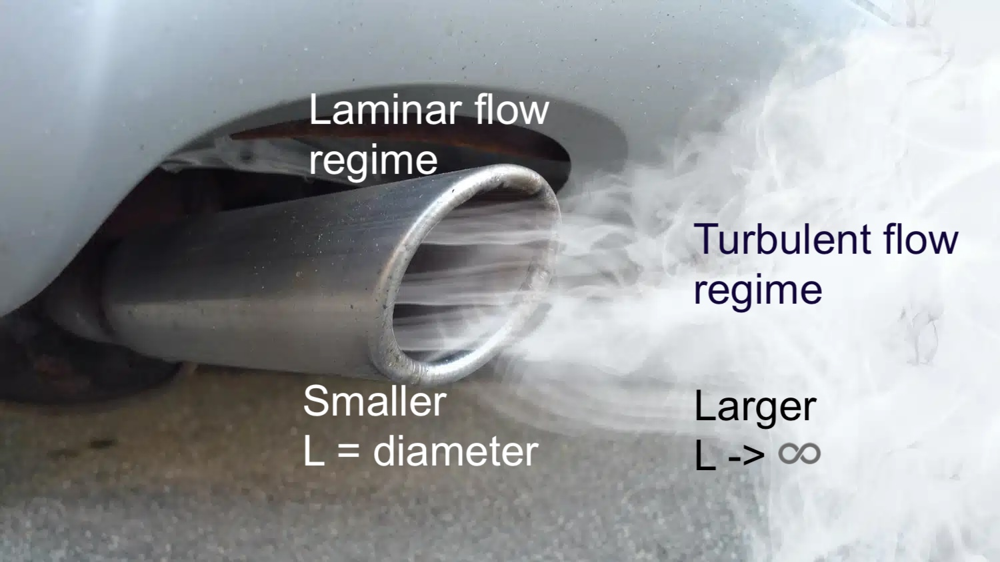
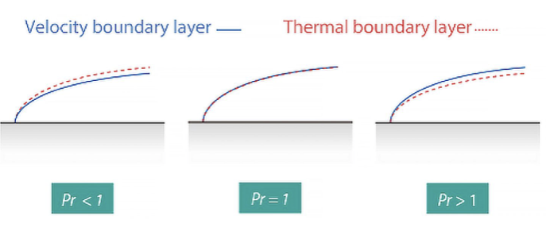

::: {.content-visible when-format="html" unless-format="revealjs"}

::: {.callout-note}
- Slides 👉  [Open presentation🗒️](./slides.html)
- PDF version of course note  👉 [Open in pdf](./L18.pdf)
- Handwritten notes 👉 [Open in pdf](./public/L18_annotated.pdf)
:::

:::

# Recitation: What Have Learned So Far?

::: {.content-visible when-format="html" unless-format="revealjs"}

::: {.callout-note}
Please use the bullet points in this recitation to review the previous topics.
:::

:::

---

## Topic 1: steady-state mass transfer

:::{.columns}
:::{.column width="33%"}
**Governing equation**
:::

:::{.column width="33%"}
**Geometry**
:::

:::{.column width="33%"}
**Applications**
:::
:::


## Topic 2: unsteady-state mass transfer

:::{.columns}
:::{.column width="33%"}
**Governing equation**
:::

:::{.column width="33%"}
**Geometry**
:::

:::{.column width="33%"}
**Applications**
:::
:::


## Topic 3: convective mass transfer (mass-transfer coefficient)

:::{.columns}
:::{.column width="33%"}
**Governing equation**
:::

:::{.column width="33%"}
**Geometry**
:::

:::{.column width="33%"}
**Applications**
:::
:::


---

## Learning Outcomes {.center}

After this lecture, you will be able to:

- **Recall** key governing equations from steady, unsteady, and convective mass transfer.
- **Describe** the roles of Reynolds, Schmidt, and Sherwood numbers in coefficient correlations.
- **Identify** how $k_c'$, concentration, and flux are linked in convective mass transfer problems.

## Dimensionless Number 1: $N_{Re}$

- **Reynolds number** measures ratio between kinetic vs viscous forces of fluid flow
- $L_D$: characteristic length of system


```{=tex}
\begin{align}
N_{\text{Re}} = \frac{L_D v \rho}{\mu}
\end{align}
```

## Meaning of $N_{Re}$

- $N_{Re}$: laminar flow vs turbulent flow
- Varies with characteristic length $L_D$ (diameter for a pipe)




## Dimensionless Number 2: $N_{Sc}$

- **Schmidt number**: ratio between momentum diffusivity and molecular diffusivity
- Related to ratio of hydrodynamic layer and mass transfer layer thickness

```{=tex}
\begin{align}
N_{\text{Sc}} = \frac{\mu}{\rho D_{AB}}
\end{align}
```

## Meaning of $N_{Sc}$

- $N_{Sc}$: fluid boundary layer thicker or mass transfer thicker?
- Similar to Prandt number in heat transfer
- $N_{Sc}^{1/3} = \dfrac{\delta}{\delta_c}$





## Dimensionless Number 3: $N_{Sh}$

- **Sherwood number**: ratio between convective mass transfer and molecular mass transfer
- Has $k_c'$ inside! --> Usually a back-calculated number

```{=tex}
\begin{align}
N_{\text{Sh}} = \frac{k_c' L}{D_{AB}}
\end{align}
```


## How Are $k_c'$ Correlated By Dimensionless Numbers?

- The combinations of these properties --> dimensionless number groups 
- The Chilton-Colburn $j_D$-factor: link to $N_{\text{Sc}}$, $N_{\text{Sh}}$, $N_{\text{Re}}$

```{=tex}
\begin{align}
j_D = f/2
&= \frac{k_c'}{v_{av}} (N_{\text{Sc}})^{2/3} \\
&= \frac{N_{\text{Sh}}}{N_{\text{Re}} N_{\text{Sc}}^{1/3}}
\end{align}
```

## General Procedure To Calculate $k_c'$

- Dimensionless numbers solely from geometry and property: $N_{Re}$, $N_{Sc}$
- Dimensionless number having $k_c'$: $N_{Sh}$
- Link between them: $j_D$
- How to obtain $j_D$?
  - Expression for different geometry / fluid flow
  - Use Table / Chart


## Summary

- Overview of dimensionless numbers to correlate mass transfer coefficients
- Dimensionless numbers: grouping different regimes
- Use table / charts to correct $k_c$ (will discuss in [Lecture 19](../L19))
