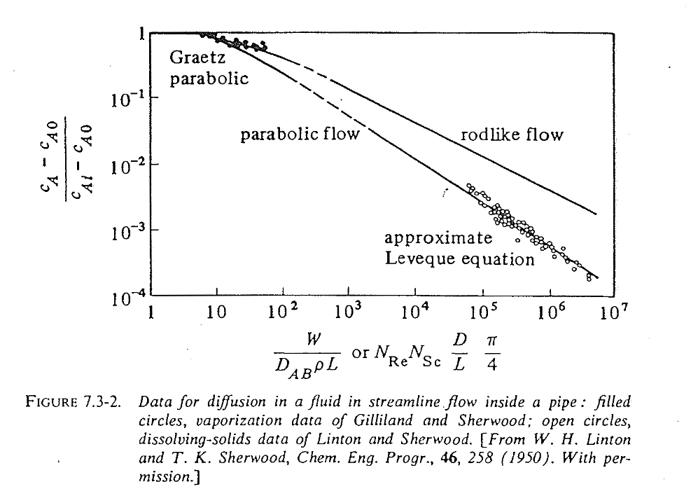

::: {.content-visible when-format="html" unless-format="revealjs"}

::: {.callout-note}
- Slides 👉  [Open presentation🗒️](./slides.html)
- PDF version of course note  👉 [Open in pdf](./L19.pdf)
- Handwritten notes 👉 [Open in pdf](./public/L19_annotated.pdf)
:::

:::


## Learning Outcomes {.center}

After this lecture, you will be able to:

- **Recall** the steps for convective mass transfer calculations using coefficient correlations and dimensionless numbers.
- **Apply** equations to calculate $k_c'$, outlet concentration, and flux for internal-flow problems.
- **Describe** how geometry and flow regime influence pipe mass transfer.


## General Procedure To Calculate $k_c'$

- Dimensionless numbers solely from geometry and property: $N_{Re}$, $N_{Sc}$
- Dimensionless number having $k_c'$: $N_{Sh}$
- Link between them: $j_D$
- How to obtain $j_D$?
  - Expression for different geometry / fluid flow
  - Use Table / Chart

## Cheatsheet For Mass Transfer Coefficient


## Example 1: Mass Transfer for Flow Inside Pipes

Problem 7.3.1: A tube is coated on the inside with naphthalene and has
inside diameter of 20 mm & a total length of 1.10 m. Air at 318 K and
average pressure of 101.3 kPa flows through the pipe with velocity of 0.8 m/s. Calculate the concentration of naphthalene at outlet

Physical properties: $D_{AB} = 6.92\times 10^{-6}\ \text{m}^2/\text{s}$, vapour pressure $p_{Ai}=74.0\ \text{Pa}$. For air, $\mu = 1.932\times 10^{-5}\ \text{Pa}\cdot \text{s}$, $\rho=1.114\ \text{kg}/\text{m}^3$


## Flow Inside Pipe: Chart



## Flow Inside Pipes: Solution Procedure

- Governing dimensionless quantity:

```{=tex}
\begin{align}
\frac{W}{D_{AB}\rho L} &= N_{Re}N_{Sc} \frac{D}{L} \frac{\pi}{4} \\
&= \frac{\text{[Total Forced Flow]} \text{(kg/s)}}{\text{[Total Diffusive Flow]} \text{(kg/s)}}
\end{align}
```

- If gas 👉 use the "rodlike flow" line
- If liquid, distinguish 2 cases
  - parabolic flow ($N_{Re} < 2100;\ \frac{W}{D_{AB}\rho L} > 400$)
  - turbulent flow ($N_{Re} > 2100;\ 0.6 < N_{Sc} < 3000$)

## Flow Inside Pipes: Solution For Liquid

:::{.columns}
:::{.column width="50%"}

**Parabolic flow**

```{=tex}
\begin{align}
\frac{c_A - c_{A,0}}{c_{A,i} - c_{A,0}}
&= 5.5
\left[
\frac{W}{D_{AB}\,\rho\,L}
\right]^{-\tfrac{2}{3}}
\end{align}
```

- $c_A$: exit concentration
- $c_{A,i}, c_{A,0}$: interface & inlet concentration
- $W$: flow rate in (kg/s)

- $k_c'$ can be calculated by $j_D$

:::

:::{.column width="50%"}

**Turbulent flow**

```{=tex}
\begin{align}
N_{Sh}
&= k_c'\left(\frac{D}{D_{AB}}\right) \\
&= \frac{k_c\,p_{BM}}{P}
\left(\frac{D}{D_{AB}}\right) \\
&= 0.023
\left(\frac{\rho D v}{\mu}\right)^{0.83}
\left(\frac{\mu}{\rho D_{AB}}\right)^{0.33} \\
&= 0.023\,
N_{Re}^{0.83}\,
N_{Sc}^{0.33}
\end{align}
```

- Similar to the $j_D$ analog
- Just need $N_{Re}$ and $N_{Sc}$ to determine $k_c'$
- Characteristic length $D$ is pipe diameter!

:::
:::

## Review Example 1: Solution Steps

Problem 7.3.1: A tube is coated on the inside with naphthalene and has
inside diameter of 20 mm & a total length of 1.10 m. Air at 318 K and
average pressure of 101.3 kPa flows through the pipe with velocity of 0.8 m/s. Calculate the concentration of naphthalene at outlet

Physical properties: $D_{AB} = 6.92\times 10^{-6}\ \text{m}^2/\text{s}$, vapour pressure $p_{Ai}=74.0\ \text{Pa}$. For air, $\mu = 1.932\times 10^{-5}\ \text{Pa}\cdot \text{s}$, $\rho=1.114\ \text{kg}/\text{m}^3$

- Step 1: Calculate $N_{Re}$, $N_{Sc}$. Which regime?

## Review Example 1: Solution Steps

- Step 2: find normalized concentration on chart

{width="65%"}

## Example 1: Follow up

1) How will the outlet concentration change, if we double the gas velocity (i.e. $v_m = 1.6$ m/s)?

2) If gas-phase $D_{AB}$ becomes smaller, how will the outlet concentration change?

## Example 1-2: Pipe Mass Transfer In Liquid

Problem 7.3-2: Pure water at 26.1°C ($ρ = 996\ \text{kg}/\text{m}^3$, $\mu = 8.71\times 10^{-4}$ Pa·s) flows at an average velocity of 0.0305 m/s through a tube of
inside diameter 6.35 mm. The tube is 1.829 m long, and the last 1.22 m of the tube wall is coated with benzoic acid.

The solubility of benzoic acid in water is 0.02948 kg mol/m$^3$, and the diffusivity of benzoic acid in water is $1.245 \times 10^{-9}$ m$^2$/s. For water, $\mu=8.71\times 10^-4$ Pa$\cdot$s and $\rho=996$ kg/m$^3$. Calculate the cross-sectional average concentration of benzoic acid at the outlet.

## Example 1-2: Solution Steps

- Step 1: calculate $N_{Re}$, $N_{Sc}$. Regime?
- Step 2: check the value $W/D_{AB} \rho L$. Able to use liquid formula?
- Step 3: insert into equations

:::{.columns}
:::{.column width="50%"}

**Parabolic flow**

```{=tex}
\begin{align}
\frac{c_A - c_{A,s}}{c_{A,i} - c_{A,s}}
&= 5.5
\left[
\frac{W}{D_{AB}\,\rho\,L}
\right]^{-\tfrac{2}{3}}
\end{align}
```

:::

:::{.column width="50%"}

**Turbulent flow**

```{=tex}
\begin{align}
N_{Sh}
&= k_c'\left(\frac{D}{D_{AB}}\right) \\
&= \frac{k_c\,p_{BM}}{P}
\left(\frac{D}{D_{AB}}\right) \\
&= 0.023
\left(\frac{\rho D v}{\mu}\right)^{0.83}
\left(\frac{\mu}{\rho D_{AB}}\right)^{0.33} \\
&= 0.023\,
N_{Re}^{0.83}\,
N_{Sc}^{0.33}
\end{align}
```

:::
:::

## Example 1-2: Results

:::{.callout-note}
- Use $L_D=6.35$ mm for $N_{\text{Re}}$
- Please use $L=1.22$ m for $N_{\text{Sh}}$!
:::

The following numbers were obtained

- $N_{\text{Re}}=221.4$
- $N_{\text{Sc}}=702.41$
- $W=9.616\times 10^{-4}$ kg / s
- x-axis: 634.4
- Use the **liquid laminar** equation to get $c_{A,\text{out}}=2.196\times 10^{-3}$ kg mol/m$^3$

## Summary

- Learn to use the coefficient chart to solve for different systems
- Case study of transport in a tube geometry
