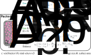
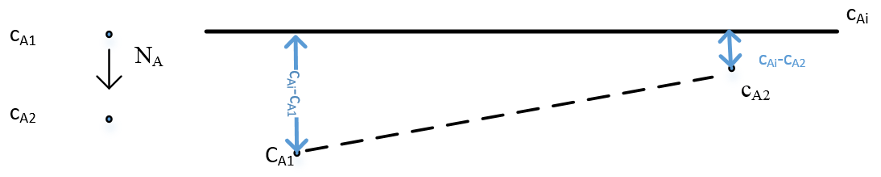

::: {.content-visible when-format="html" unless-format="revealjs"}

::: {.callout-note}
- Slides 👉  [Open presentation🗒️](./slides.html)
- PDF version of course note  👉 [Open in pdf](./L21.pdf)
- Handwritten notes 👉 [Open in pdf](./public/L21_annotated.pdf)
:::

:::


## Learning Outcomes {.center}

After this lecture, you will be able to:

- **Recall** how packed-bed mass transfer coefficients compare with those of other geometries.
- **Describe** mass-balance equations for packed-bed columns.
- **Identify** concentration and pressure profiles inside a packed column.

## Recall From Last Week: Mass Transfer Correlations

- Goal: calculate $k_c'$ from:
  - geometry ($L_D, L, D_P$, etc)
  - properties ($\mu, \rho, D_{AB}, v$, etc)

- Calculate $N_{\text{Re}}$, $N_{\text{Sc}}$

- Get $j_D$ and / or $N_{\text{Sh}}$ to back-calculate $k_c'$

## A Deeper Look Into Packed Bed



## Recall From Last Week: Comparison Between Geometries

_Adapted from Problem 7.3-3_. Let's estimate the gas-phase mass
transfer coefficient $k_G$ (kg mol/(m$^2$ s Pa)) for mass transfer of
water vapour to solids with different shapes. Consider a water vapour
(A) in air (B) at 338.6 K and 101.32 Pa flowing through a big duct
containing solids with various geometries. The flow velocity is 3.66
m/s. The water vapour concentration is small, so property of air is
used ($\mu=2.03\times 10^-5$ Pa$\cdot$s, $\rho=1.043$ kg/m$^3$). From
the table, $D_{AB} = 2.88 \times 10^{-5}$ m$^2$/s at 315 K. Compare
the values for following geometries, which case?

a) Flow parallel to flat plate with length $L=2.54$ cm
b) A single sphere with diameter $D=2.54$ cm
c) Packed beds using spheres of average diameter $D_p=2.54$ cm and $\epsilon=0.35$

## Case 3: Results

::: {.callout-tip}
- Do not forget to correct $D_{AB}$ for temperature!
- Choose the right $N_{\text{Sh}}$ or $j_D$ formula according to $N_{\text{Re}}$ and $N_{\text{Sc}}$
- $k_G \approx k_G' = k_c' / (RT)$
:::

- Flat surface: $k_G = 1.738\times 10^{-8}$ kg mol/(m$^2$ s Pa). $N_{\text{Sh}} = 38.03$
- Single sphere: $k_G = 1.984\times 10^{-8}$ kg mol/(m$^2$ s Pa). $N_{\text{Sh}} = 43.40$
- Packed bed: $k_G = 7.60\times 10^{-8}$ kg mol/(m$^2$ s Pa). $N_{\text{Sh}} = 166.32$

Packed bed clearly wins!

## Why Packed Bed Columns Have Better Mass Transfer?

- Packed bed geometry provides large surface-to-volume ratio ($\epsilon$ and $D_p$)

- The boundary layer length $\delta c$ is small due to continuous disruption of liquid/gas interface

- Overall $k_c'$ is larger than single geometry

- Pressure drop $\Delta p$ over the column can be larger than other types!

## Compute Mass Transfer In Packed Bed Columns

In a packed bed design, it is often desired to know the following quantities:

1) The outlet concentration $c_{A2}$
2) The total flux of mass transfer accross interface

- It is still desired to use [In] - [Out] + [Gen] = [Acc]
- What are each of these quantities?


## Mass Balance In Packed Beds

- Volumetric flow rate is $Q$ (unit m$^3$/s)
- Inlet, outlet concentration: $c_{A1}$, $c_{A2}$
- Cross sectional area $S$
- Interfacial mass transfer flux $N_A$, effective area $A_{\text{eff}}$

```{=tex}
\begin{align}
\text{[In]} - \text{[Out]} + \text{[Gen]} &= \text{[Acc]} \\
Q (c_{A1} - c_{A2}) + A_{\text{eff}} \hat{N}_A = 0
\end{align}
```

## The Effective Area $A_{\text{eff}}$

- $A_{\text{eff}}$ related to the surface-to-volume ratio $a$ and total bed volume $V_b$

```{=tex}
\begin{align}
A_{\text{eff}} = a V_{b}
\end{align}
```

- For spheres, we can derive $a$ (unit m$^2$/m$^3$)

```{=tex}
\begin{align}
a = \frac{6(1 - \epsilon)}{D_p}
\end{align}
```

## How To Get $\hat{N}_A$?

- $\hat{N}_A$ is the **average** mass transfer flux accross the interface.
- To solve it, we still use a control volume from $z$ to $z+ dz$
- Locally, driving force $c_{Ai} - c_{A}(z)$
- Local mass transfer flux

```{=tex}
\begin{align}
N_A(z) = k_c \left[c_{Ai} - c_{A}(z)\right]
\end{align}
```

## Differential Equation for $c_A(z)$

```{=tex}
\begin{align}
N_A a S dz &= Q d c_A \\
\frac{k_c a S}{Q} dz
&= \frac{d c_A}{c_{Ai} - c_{A}(z)}
\end{align}
```

Integrating over $z$ we get:

```{=tex}
\begin{align}
\ln\!\left(
\frac{c_{Ai} - c_{A1}}{c_{Ai} - c_{A}(z)}
\right) = \frac{k_c a S z}{Q}
\end{align}
```

## Concentration Profile Of Packed Bed (Single Phase)

- When $c_{Ai}$ is constant (e.g. solid-gas interface), concentration follows:

```{=tex}
\begin{align}
c_{A}(z) = 
c_{Ai} - (c_{Ai} - c_{A1})\exp(- \frac{k_c a S}{Q} z)
\end{align}
```

- Analog: reactive wall in pipe system (unsteady-state mass transfer in [Lecture 11](../L11))

```{=tex}
\begin{align}
c_{A}(z) = c_{Ai} - (c_{Ai} - c_{A1})\exp(- \frac{4 k_c z}{Dv_m})
\end{align}
```

The pipe wall problem corresponds to $a=4 / D$, similar to a packed bed problem.

- Clearly, packed bed can achieve saturation much faster, because $D_p$ is usually a few mm to 1 inch.


## Outlet Concentration For Packed Bed

- If a packed bed column has height $H$, outlet concentration $c_{A2}$ follows:

```{=tex}
\begin{align}
c_{A2} = 
c_{Ai} - (c_{Ai} - c_{A1})\exp(- \frac{k_c a S H}{Q})
\end{align}
```

- Rearrange gives

```{=tex}
\begin{align}
\ln\!\left(
\frac{c_{Ai} - c_{A1}}{c_{Ai} - c_{A2}}
\right)
&= \frac{k_c a S H}{Q} \\
&= \frac{k_c A_{\text{eff}}}{Q}
\end{align}
```

## Solving The Average Mass Transfer Flux $\hat{N}_A$

- We can further use the mass balance equation $Q(c_{A1} - c_{A2}) + \hat{N}_A A_{\text{eff}} = 0$.
- Use the fact $c_{A2} - c_{A1} = (c_{Ai} - c_{A1}) - (c_{Ai} - c_{A2})$


<!-- ```{=tex} -->
<!-- \begin{align} -->
<!-- Q(c_{A2} - c_{A1}) &= k_c A_{\text{eff}} \frac{c_{A2} - c_{A1}}{\ln\!\left( \frac{c_{Ai} - c_{A1}}{c_{Ai} - c_{A2}} \right)} \\ -->
<!-- &= k_c A_{\text{eff}} \frac{(c_{Ai} - c_{A1}) - (c_{Ai} - c_{A2})}{\ln\!\left( -->
<!-- \frac{c_{Ai} - c_{A1}}{c_{Ai} - c_{A2}} -->
<!-- \right)} -->
<!-- \end{align} -->
<!-- ``` -->

That gives us

$$
\hat{N}_{A} = k_c \frac{(c_{Ai} - c_{A1}) - (c_{Ai} - c_{A2})}{\ln\!\left(
\frac{c_{Ai} - c_{A1}}{c_{Ai} - c_{A2}} \right)}
$$


## Average Mass Transfer Flux By Log-Mean Driving Force

The previous result means the average driving force in a
exponentially-changing concentration profile like in packed bed,
should be expressed in **log-mean driving force** form.

It is an expression we will frequently see in other column setups with mixing interfaces

$$
\hat{N}_{A} = k_c \frac{(c_{Ai} - c_{A1}) - (c_{Ai} - c_{A2})}{\ln\!\left(
\frac{c_{Ai} - c_{A1}}{c_{Ai} - c_{A2}}
\right)}
$$




## Example 4: Packed Bed Design 

In this lecture, we show that the outlet concentration will be
saturated when the tube is long enough.

```{=tex}
\begin{align}
c_{A2} = 
c_{Ai} - (c_{Ai} - c_{A1})\exp(- \frac{A k_c}{Q})
\end{align}
```

- Consider all parameters in case 3, how high should we design the packed bed to ensure saturated outlet concentration?
- $D_p=2.54$ cm, $\epsilon=0.35$, $k_c'=0.214$ m/s, $v_m=3.66$ m/s
- You can consider effective saturation means $\frac{A k_c}{Q} = 5$

## Example 4: Packed Bed Design -- Results

- Minimal height: $H_{\text{min}}$

$$
H_{\text{min}} = \frac{5 v_m D_p}{6 (1 - \epsilon) k_c'}
$$

- In case 3 setup, $H_{\text{min}}=0.556$ m


## Summary

- Dimensionless numbers can be used to correlate mass transfer problems in different flow rate, dimension etc
- Typically, start with a known geometry (pipe? parallel plate? sphere? packed bed?)
- Find the correlation with dimensionless numbers $N_{Re}$, $N_{Sc}$
- Calculate the final mass transfer rate


