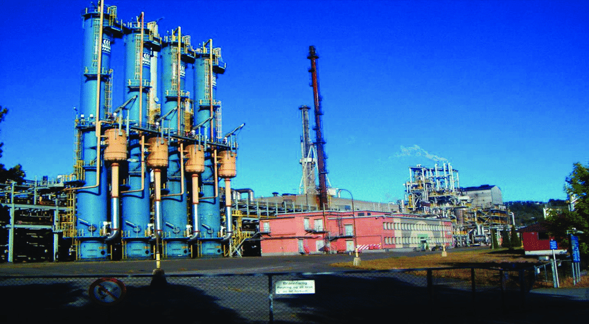
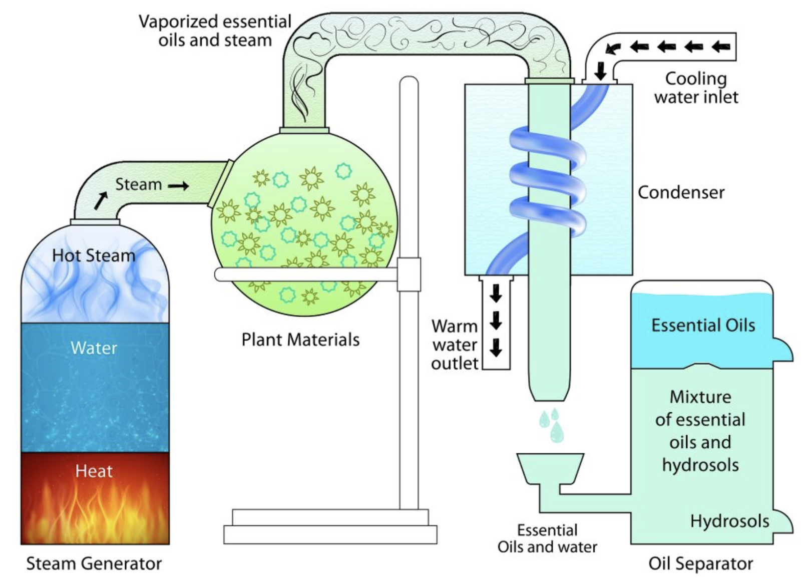
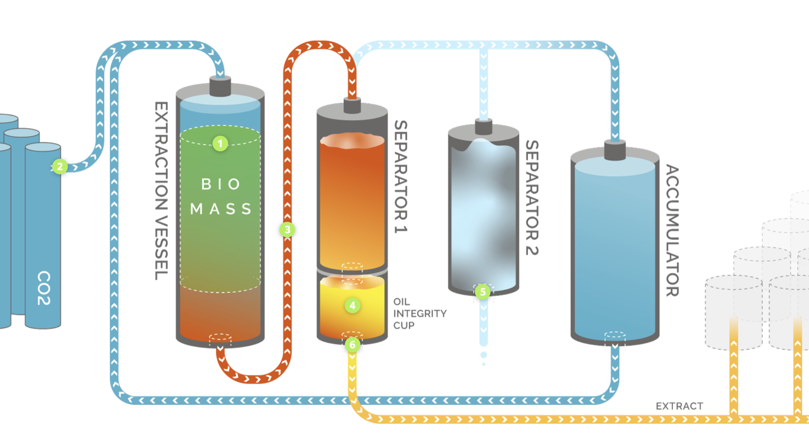
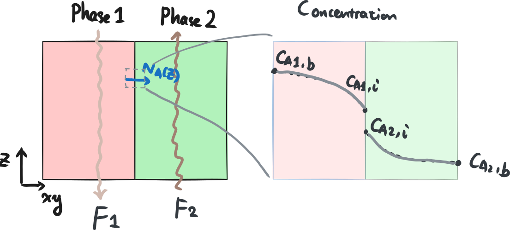
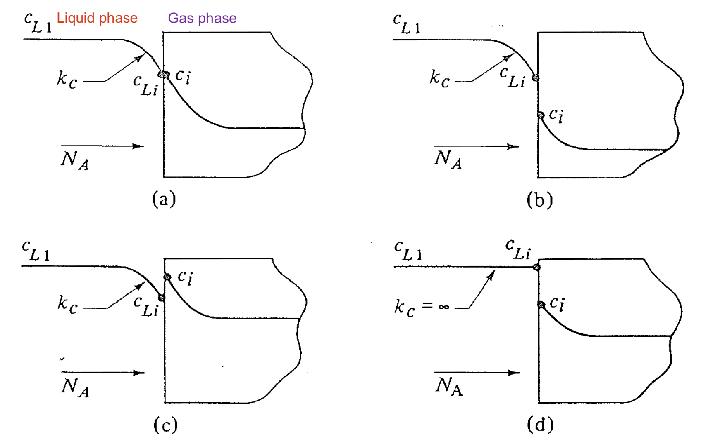
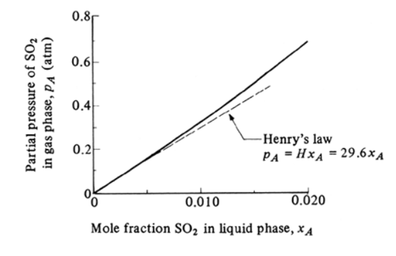
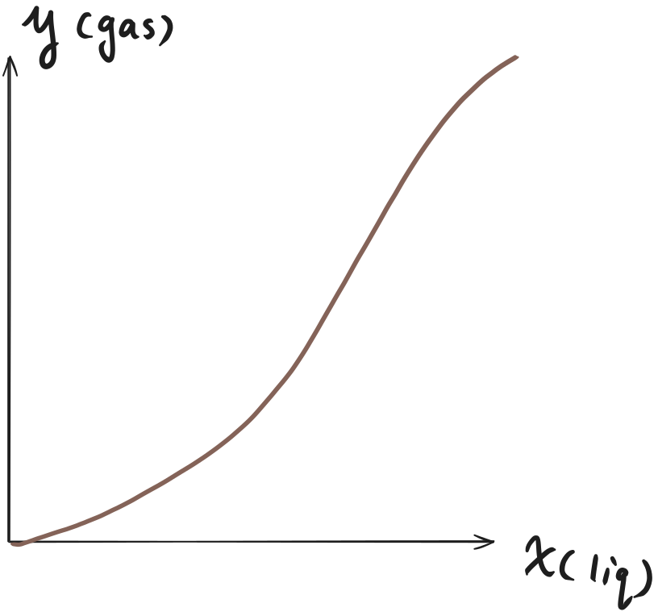
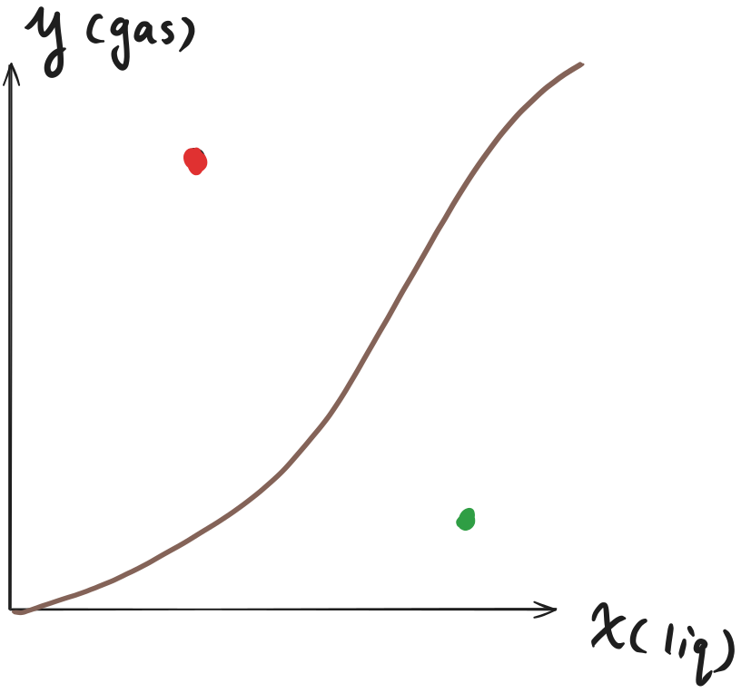
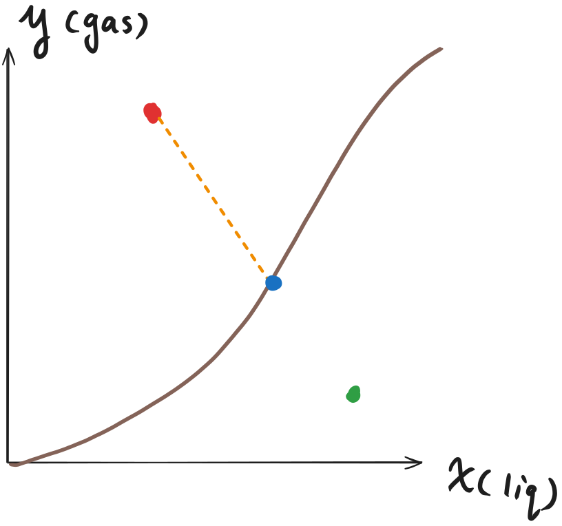

::: {.content-visible when-format="html" unless-format="revealjs"}

::: {.callout-note}
- Slides 👉  [Open presentation🗒️](./slides.html)
- PDF version of course note  👉 [Open in pdf](./L22.pdf)
- Handwritten notes 👉 [Open in pdf](./public/L22_annotated.pdf)
:::

:::


## Learning Outcomes {.center}

After this lecture, you will be able to:

- **Recall** the equilibrium conditions that apply at phase interfaces.
- **Describe** equilibrium diagrams for two-phase mass transfer systems.
- **Apply** coupled flux and equilibrium relations to determine interfacial compositions.

## What Systems Have We Studies So Far?

The most complex case is probably a packed-bed column.

- We we have focused on?
  - Mass transfer in **1 phase** -- gas flow over solid spheres
  - Solve mass balance equation in flow direction -- get **outlet** concentration
  - Solve mass transfer to beds -- get concentration profiles using **fixed interfacial concentration**

- What we may miss?

  - Real-world applications are mass transfer between 2 phases
  - Mass transfer may occur accross 2 phase interfaces
  - Equilibrium concentration at interfaces are usually not fixed

## Examples of 2-Phase Mass Transfer (1)

**Absorption tower**

- Water-soluble gases from industrial reaction mixture is transferred into aqueous solution
- Examples:
  - ammonia (NH$_3$) from Haber-Bosch process
  - CO$_2$ capture (a hot topic!)



## Examples of 2-Phase Mass Transfer (2)

**Extraction apparatus** (liquid-gas)

- Volatile chemical compounds originally mixted with water is extracted to vapour phase
- Examples:
  - Essense oil extraction



## Examples of 2-Phase Mass Transfer (3)

**Extraction apparatus** (liquid-liquid)

- Chemical compound in low solubility liquid is transferred to high solubility liquid
- Examples:
  - Supercritical CO$_2$ extraction of bioactive compounds



## Common Feature Of 2-Phase Mass Transfer

- Flow rate and interface transfer are usually orthogonal
- Interface concentration has discontinuity



## Mass Balance Equation In 2-Phase M.T.

Overall mass balance between liquid and gas

```{=tex}
\begin{align}
\text{In}_{\text{liq}} + \text{In}_{\text{gas}}
=
\text{Out}_{\text{liq}} + \text{Out}_{\text{gas}}
\end{align}
```

- In and outlet usually can be described by $\text{[Flow rate]}\times \text{[Concentration]}$
- Depends on the direction of flow and control volume!

## Mass Balance Equation In Single Phase

In each phase, we can use our knowledge from [packed bed lecture](../L21), e.g.

```{=tex}
\begin{align}
\text{In}_{\text{gas}} - \text{Out}_{\text{gas}} + \text{Gen}_{\text{gas}} &= 0 \\
Q (c_1 - c_2) + A_{\text{eff}} \hat{N}_{\text{eff}} &= 0
\end{align}
```

- $\hat{N}_{\text{eff}}$ is the average molar inter-phase flux, and $A_{\text{eff}}$ is the effective contact area
- Cannot use packed-bed solution for $\hat{N}_{\text{eff}}$ because interfacial concentration can vary!


## How Can We Describe The Interfacial Transport?

In [Lecture 14](../L14) we discussed the interfacial concentration and mass balance. We need to know
1) The equilibrium constant $K$ at the interface
2) The ratio between $k_c'$ in two phases

{width="95%"}

## The Equilibrium Plot For Gas-Liquid Interface

Most commonly in industry we can use the equilibrium plot between A's
molar fractions in gas $y_A$ (or $p_A$) and liquid $x_A$, respectively.

Simpliest situation is Henry's law

$$
p_A = H x_A
$$



## Reading An Equilibrium Plot (1)

Meaning of points on the equilibrium curve -- interfacial concentraion



## Reading An Equilibrium Plot (2)

- Points above the equilibrium curve 👉 $N_A$: gas → liquid (vice versa)



## Reading An Equilibrium Plot (3)

- Non-equilibrium point + line with slope $-k_x / k_y$ 👉 interfacial concentration




## Equilibrium Phase: Flux Balance

- The slope + intercept method stems from the flux balance between phases

```{=tex}
\begin{align}
N_A(g) &= N_A(l) \\
k_y (y_{AG} - y_{Ai}) &= k_x (x_{Ai} - x_{AL})
\end{align}
```

- We have

```{=tex}
\begin{align}
\text{Slope} &= \frac{y_{AG} - y_{Ai}}{x_{AL} - x_{Ai}} \\
&= - \frac{k_x}{k_y}
\end{align}
```

## Example 1: Finding Equilibrium Interface Concentrations

A solute is being absorbed from a gas mixture of A and B in a
wetted-wall tower, with the liquid flowing downwards. At a certain
point in the tower, the bulk gas concentration of A is $y_{AG}=0.380$
and the bulk liquid fraction is $x_{AL}=0.100$. The film transfer
coefficients for A in gas and liquid phases are: $k_y'=1.465\times 10^{-3}$ kg mol/m$^2$/s and $k_x'=1.967\times 10^{-3}$ kg mol/m$^2$/s. You can assume the $k_x' \approx k_x$ and $k_y' \approx k_y$. The following pairs of equilibrium $(x_Ai, y_Ai)$ data were measured:

$(0.0, 0.0), (0.05, 0.022), (0.10, 0.052) (0.15, 0.087)$

$(0.20, 0.131), (0.25, 0.187), (0.30, 0.265), (0.35, 0.385)$

1) Find the interface concentrations $y_{Ai}$ and $x_{Ai}$
2) Calculate the $N_A$ at this point

## Solution steps:

1) Draw the equilbirum plot with interpolation
2) Draw the current $(x_{AL}, y_{AG})$ point on graph, which direction of mass transfer?
3) Draw line with slow of $-k_x/k_y$
4) Read the intersect with equilibrium curve as $(x_{Ai}, y_{Ai})$
5) Calculate $N_A = k_y (y_{AG} - y_{Ai})$

## Example 1: Solution Plot

```{python}
#| echo: false
import numpy as np
import matplotlib.pyplot as plt

# Given bulk compositions
y_AG = 0.380
x_AL = 0.100

# Given film coefficients (treat as ky, kx per problem statement)
k_y = 1.465e-3
k_x = 1.967e-3

# Equilibrium data (x_Ai, y_Ai)
x_eq = np.array([0.0, 0.05, 0.10, 0.15, 0.20, 0.25, 0.30, 0.35])
y_eq = np.array([0.0, 0.022, 0.052, 0.087, 0.131, 0.187, 0.265, 0.385])

# Operating line from two-film theory:
# N_A = k_y (y_AG - y_i) = k_x (x_i - x_AL)
# => y_i = y_AG - (k_x/k_y) (x_i - x_AL)
m = -(k_x / k_y)
b = y_AG - m * x_AL  # y = m x + b

def y_oper(x):
    return m * x + b

# Piecewise-linear interpolation of equilibrium curve and intersection with operating line
# Find interval where (y_eq - y_oper(x_eq)) changes sign
g = y_eq - y_oper(x_eq)
idx = np.where(np.sign(g[:-1]) * np.sign(g[1:]) <= 0)[0]

if len(idx) == 0:
    raise RuntimeError("No intersection found within provided equilibrium data range.")

i = idx[0]
# Linear interpolation on [x_i, x_{i+1}] for equilibrium: y = y0 + (y1-y0)*(x-x0)/(x1-x0)
x0, x1 = x_eq[i], x_eq[i+1]
y0, y1 = y_eq[i], y_eq[i+1]
s = (y1 - y0) / (x1 - x0)  # equilibrium segment slope

# Solve y_eq_lin(x) = y_oper(x):
# y0 + s (x - x0) = m x + b
x_int = (y0 - s * x0 - b) / (m - s)
y_int = y_oper(x_int)

# Flux at the point
N_A_gas = k_y * (y_AG - y_int)
N_A_liq = k_x * (x_int - x_AL)

print(f"Interface concentrations: x_Ai = {x_int:.6f}, y_Ai = {y_int:.6f}")
print(f"N_A from gas film:    {N_A_gas:.6e} (same units as k_y)")
print(f"N_A from liquid film: {N_A_liq:.6e} (same units as k_x)")

# Plot
xx = np.linspace(x_eq.min(), x_eq.max(), 400)

plt.figure()
plt.plot(0.100, 0.380, "s")
l, = plt.plot(x_eq, y_eq, "o", label="Equilibrium data")
plt.plot(xx, np.interp(xx, x_eq, y_eq), "-", color=l.get_c())
plt.plot(xx, y_oper(xx), "--",)
plt.plot([x_int], [y_int], "s")

plt.xlabel(r"$x_A$")
plt.ylabel(r"$y_A$")
plt.title(r"Find $(x_{Ai}, y_{Ai})$ from equilibrium ∩ operating line")
plt.xlim(x_eq.min(), x_eq.max())
plt.ylim(min(0, y_oper(x_eq).min(), y_eq.min()), max(y_oper(x_eq).max(), y_eq.max()))
plt.grid(True, alpha=0.3)
plt.legend()
plt.show()
```

## Example 1: Answers

- Slope of curve $-k_x/k_y = -1.343$
- Interfacial concentration $(x_{Ai}, y_{Ai}) = (0.246, 0.180)$
- Flux: $N_A =0.29 \times 10^{-3}$ kg mol/m$^2$/s
- Direction of flux: gas to liquid

  


## Summary

- Real industrial applications involve mass transfer between 2 phases
- Equilibrium plots are extremely useful for elucidating the interfacial balance
- Describe driving force and interfacial concentrations from the equilibrium plot


