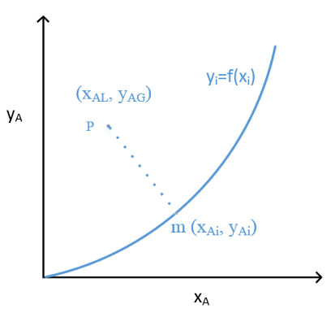
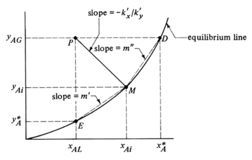
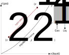
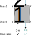
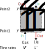
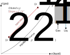
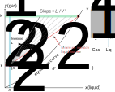

::: {.content-visible when-format="html" unless-format="revealjs"}

::: {.callout-note}
- Slides 👉  [Open presentation🗒️](./slides.html)
- PDF version of course note  👉 [Open in pdf](./L23.pdf)
- Handwritten notes 👉 [Open in pdf](./public/L23_annotated.pdf)
:::

:::


## Learning Outcomes {.center}

After this lecture, you will be able to:

- **Recall** the overall mass-balance framework for two-phase absorption systems.
- **Identify** the operating line on an equilibrium diagram.
- **Apply** equations to calculate outlet composition and minimum flow rate for an absorption tower.

## Recall: Reading An Equilibrium Diagram

:::{.columns}
:::{.column width="50%"}

Key features:

- x-axis & y-axis meaning?
- Points on the eq. curve?
- Points above and below eq. curve?
- How to get interfacial fraction?
- Slope of line to interfacial points? 

:::

:::{.column width="50%"}

{width="95%"}

:::

:::

## Local Overall Mass Transfer Coefficients

- Knowing $k_x$ and $k_y$ (film coefficients) allows us to calculate the interfacial concentration $(x_{Ai}, y_{Ai})$
- **However**, in many industrial applications exact $k_x$ and $k_y$ are hard to find
- Use of overall mass transfer coefficients



## Relation Between Overall And Exact Mass Transfer Coefficients

- Exact coefficient $k_x$, $k_y$: driving force $y_{AG} - y_{Ai}$

$$
N_A = k_y(y_{AG} - y_{Ai})
$$

- Overall coefficient $K_x$, $K_y$: driving force $y_{AG}-y_A^*$

$$
N_A = K_y (y_{AG} - y_A^*) = K_x (x_A^* - x_{AL})
$$

## $K_x$ and $K_y$ On A Diagram

- What are the driving forces associated with $K_x$ and $K_y$?


## $(x, y)$ Relation In A Reactor

- Consider an absorption tower with gas inlet at $y_{A1}$ and outlet at
  $y_{A2}$
- The gas solute is continuously absorbed by the flowing water phase
- Which is larger, $y_{A1}$ or $y_{A2}$?

## Absorption Operating Line in Equilibrium Diagram

:::{.callout-tip}
- Mass balance tells us $y_{A1} > y_{A2}$
- A series of $(x, y)$ points during the operation forms the **operating line**
:::



## What Questions Do We Want To Study?

:::{.columns}
:::{.column width="50%"}

Given information about the absorption tower, can we answer?

- In- and out-let molar fractions ✅
- Required liquid / gas flow rate ✅
- Concentration profile → **needs to know** $N_A$
- Height of tower needed → **needs to know** $N_A$

:::

:::{.column width="50%"}

{width="85%"}

:::

:::

## Mass Balance In Whole Control Volume

:::{.columns}
:::{.column width="50%"}

Mass balance for 2 phases:

```{=tex}
\begin{align}
\text{In}_{\text{liq}} + \text{In}_{\text{gas}}
 &= \text{Out}_{\text{liq}} + \text{Out}_{\text{gas}} \\
L_2 x_2 + V_1 y_1 &= L_1 x_1 + V_2 y_2
\end{align}
```

- $L_1 = L' + L_{x1}$ ($L'$: flow rate inert liquid)
- $V_1 = V' + V_{y1}$ ($V'$: flow rate inert gas)


:::

:::{.column width="50%"}

{width="85%"}

:::

:::

## Explanation For Flow Rates

:::{.callout-note}
Other flow rates: $Q$ (m$^3$/s); $W$ (kg/s); $v$ (m/s)
:::

- $L$: molar flow rate (kg mol/s) for liquid phase
  - $L'$: flow rate for inert liquid
  - $L_{x1}$: flow rate for A at molar fraction $x_1$
- $V$: molar flow rate (kg mol/s) for gas phase
  - $V'$: flow rate for inert gas
  - $V_{y1}$: flow rate for A at molar fraction $y_1$

## Mass Balance For Operating Line

The two ends of the operating line $(x_1, y_1)$ and $(x_2, y_2)$ follow:

```{=tex}
\begin{align}
L'\left(\frac{x_2}{1 - x_2}\right)
+
V'\left(\frac{y_1}{1 - y_1}\right)
=
L'\left(\frac{x_1}{1 - x_1}\right)
+
V'\left(\frac{y_2}{1 - y_2}\right)
\end{align}
```

## Meaning of the Operating Line

When $1 - x_1 \approx 1$ and $1 - y_1 \approx 1$, we can rewrite the
mass balance equation for any $(x, y)$ along the operating line

:::{.columns}
:::{.column width="50%"}

```{=tex}
\begin{align}
y = \left(\frac{L'}{V'}\right) x +
\left[ y_1 -
\left(
\frac{L'}{V'}
\right)x_1
\right]
\end{align}
```

:::

:::{.column width="50%"}

{width="85%"}


:::

:::

## Absorption Tower Design Requirements

In absorption tower, we usually know the following quantities:

- Gas inlet fraction $y_1$ and flow rate $V_1$
  - $V'$ can be calculated
- Liquid inlet fraction $x_2$ (usually $x_2=0$)
- The equilibrium curve $y=f_{\text{eq}}(x)$

One of the following design goals may be asked:

1. Know the flow rate $L'$ → Determine $y_2$
2. $y_2$ needs to be at certain value → Determine $L'$

{.absolute right=20 bottom=20 width="35%"}

## Minimum Operating Line for Absorption Tower

For question 2, we know the requirement for $y_2$, combine with the
equilibrium chart, there is a minimum liquid flow rate
$L'_{\text{min}}$.



## Flow Rate In Absorption Tower

From the dilute regime operating line, the slope is determined by
$\left(\dfrac{L'}{V'}\right)$. Although there is a minimal
$\left(\dfrac{L'}{V'}\right)$ requirement, practical operating line
has slope that follows

$$
\left(\dfrac{L'}{V'}\right) \approx 1.5 \times \text{[Slope of Eq. Curve]}
$$

- If $L'/V'$ is too high, the column usually needs a larger diameter to compensate the pressure drop.
- If $L'/V'$ is too low, a taller absorption tower is needed for sufficient contact area.

## Example 1: Determine the Outlet Composition

A mixture of gas A in air kept at total pressure of 1 atm flows
through an absorption tower with flowing water at 293 K. The inlet gas
flow rate is $V_1 = 100$ kg mol/h, and inlet $y_1 = 0.20$. The liquid
inlet flow rate is $L' = 300$ kg mol/h and inlet contains no dissolved
gas ($x_2=0$). At the outlets the gas-liquid phases reach equilibrium following the Henry's law:

$$
y_2 = m x_1
$$

Calculate the outlet mole fraction $y_2$ and $x_1$ for the following cases:

1) A is CO$_2$, $m = 1.42\times 10^3$
2) A is SO$_2$, $m \approx 10$

## Example 2: Solution Process

- Write the mass balance equation

```{=tex}
\begin{align}
L'\left(\frac{x_2}{1 - x_2}\right)
+
V'\left(\frac{y_1}{1 - y_1}\right)
=
L'\left(\frac{x_1}{1 - x_1}\right)
+
V'\left(\frac{y_2}{1 - y_2}\right)
\end{align}
```

- Obtain $L'$ and $V'$

- $x_1$ and $y_2$ relation from Henry's law

## Example 2: Results

:::{.callout-warning}
$y_1$ and $y_2$ are supposedly large, so $1 - y_1 \approx 1$ is not correct!
:::
```{python}
#| echo: false
import math
from scipy.optimize import root

x_2 = 0.0
y_1 = 0.20
V_p = 100 * (1 - y_1)
L_p = 300

def mass_balance(x_1, m):
    lhs = L_p * (x_2 / (1-x_2)) + V_p * (y_1 / (1 - y_1))
    y_2 = m * x_1
    rhs = L_p * (x_1 / (1-x_1)) + V_p * (y_2 / (1 - y_2))
    res = lhs - rhs
    return res

def solve_system(m, x_guess=0.0):
    assert m > 0
    res = root(mass_balance, x0=x_guess, args=(m,))
    x_1 = res.x[0]
    y_2 = m * x_1
    return x_1, y_2

# CO2
x_1, y_2 = solve_system(m=0.142e4)
print(f"CO2 system: x_1 = {x_1:.3e}, y_2= {y_2:.3f}")

# SO2
x_1, y_2 = solve_system(m=10.0)
print(f"SO2 system: x_1 = {x_1:.3e}, y_2= {y_2:.3f}")    
```

## Example 2: Quanlitative Analysis

- Slope of operating line $L'/V'$  
- Slope of equilibrium curve $m$
- CO$_2$: $m \gg L'/V'$, can be treated as if gas phase concentration is fixed!
- SO$_2$: measurable decrease of SO$_2$ fraction in outlet gas

## Summary

- Reading equilibrium chart and operating line
- Mass balance equation for 2 phases
- Solving the flow rate -- concentration relation 


