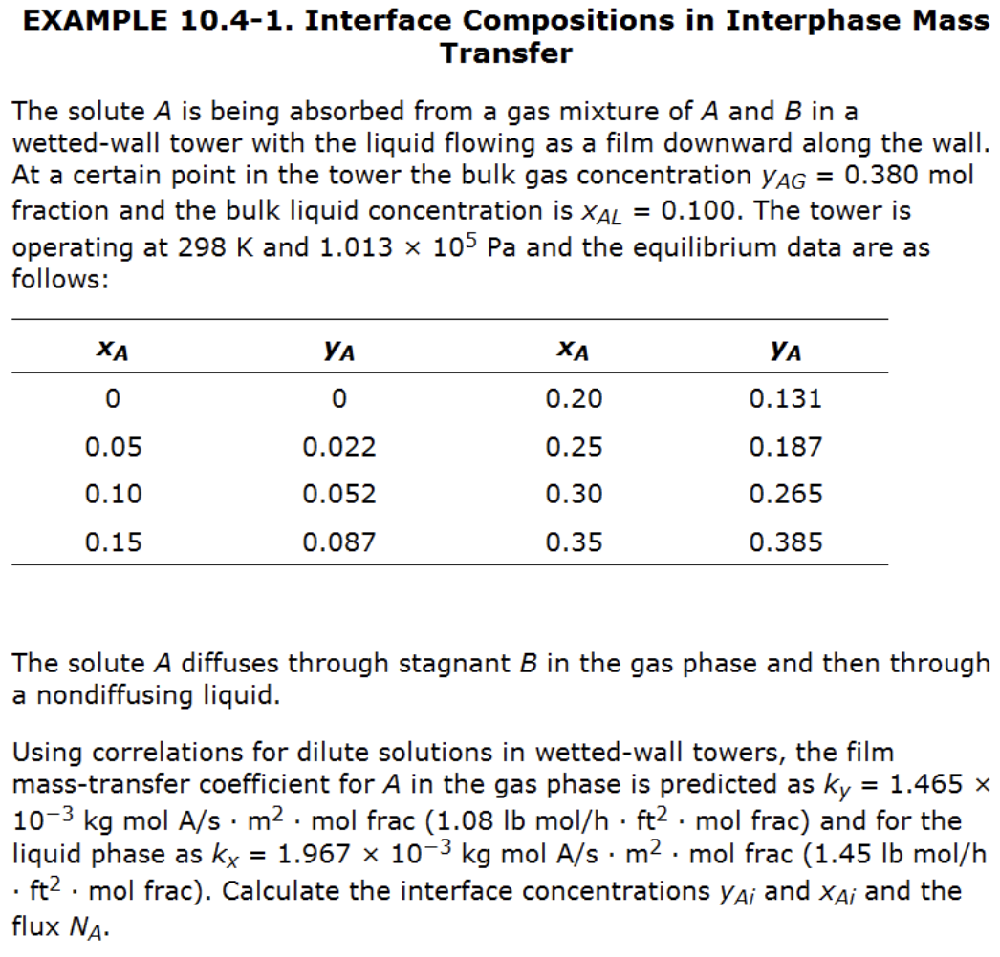
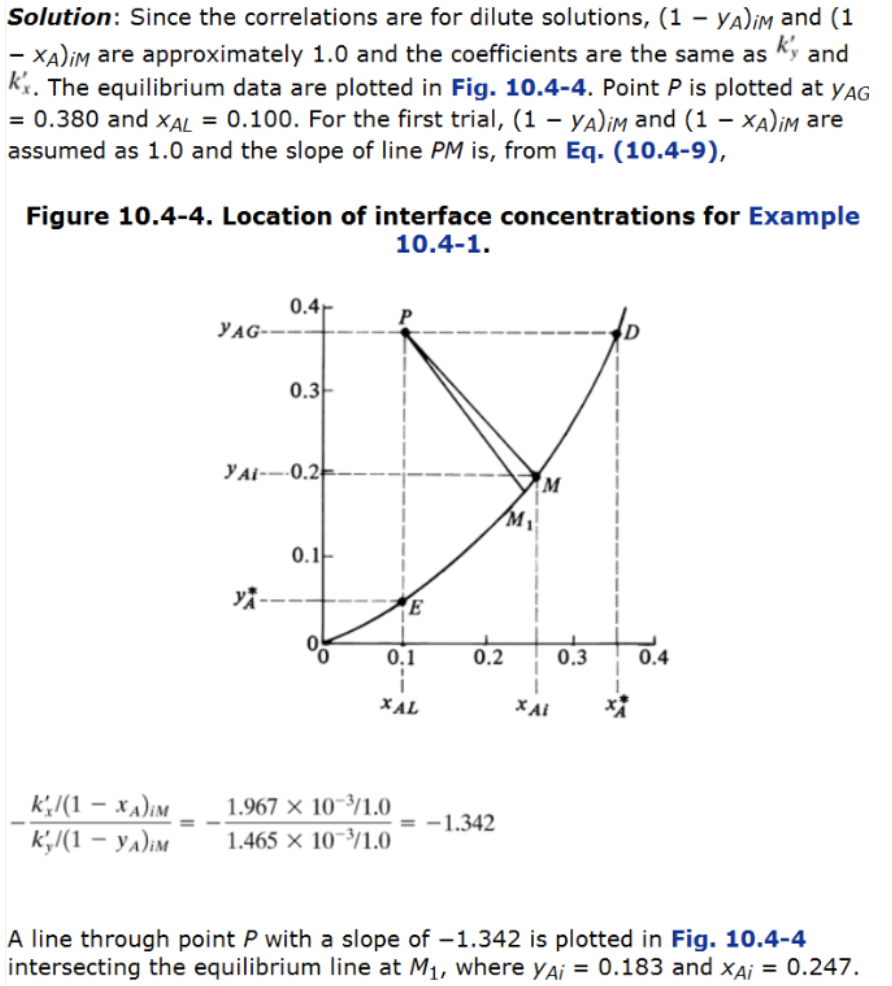
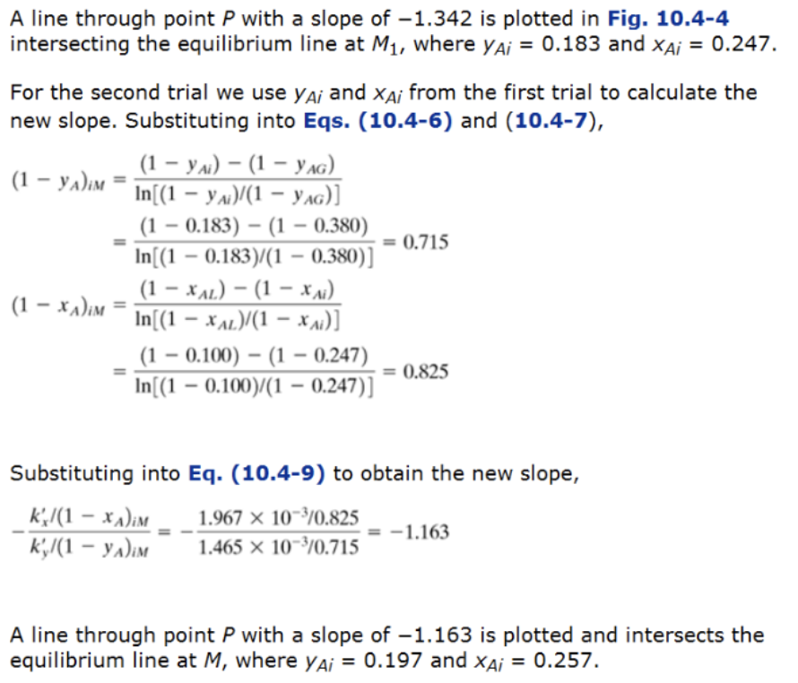
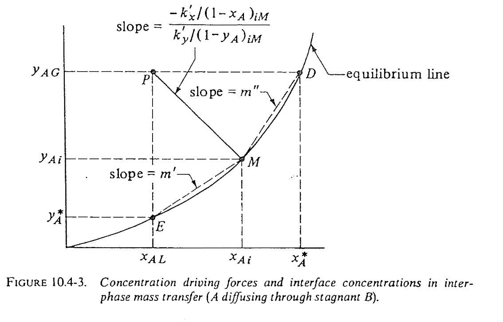
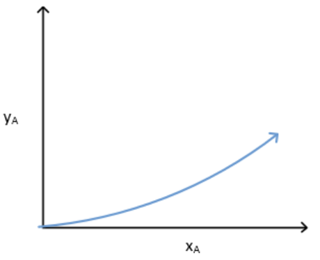
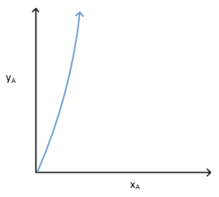
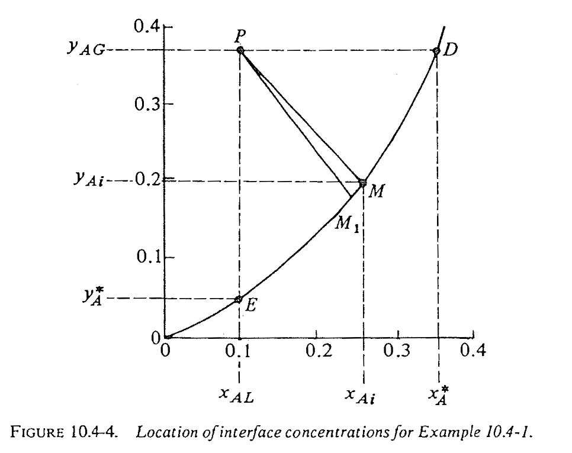
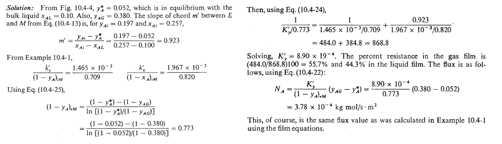

::: {.content-visible when-format="html" unless-format="revealjs"}

::: {.callout-note}
- Slides 👉  [Open presentation🗒️](./slides.html)
- PDF version of course note  👉 [Open in pdf](./L24.pdf)
- Handwritten notes 👉 [Open in pdf](./public/L24_annotated.pdf)
:::

:::


## Learning Outcomes {.center}

After today's lecture, you will be able to:

- Recall the general mass transfer flux in stagnant B films
- Apply the rule to find interfacial concentration and flux
- Analysis for mass balance equation _inside_ the absorption column


## Recall of last week: two-phase mass transfer

Useful tool: equilibrium diagram

:::{.columns}
:::{.column width="50%"}

Key features:

- x-axis & y-axis meaning?
- Points on and below curve?
- Equilibrium line and operating line?
- Points above and below eq. line?
- Meaning of operating line with flow rates?

:::

:::{.column width="50%"}

{width="95%"}

:::

:::

## Recap: Key equation 1 -- Flux relation

For **very diluted** (EMCD-like) system, the flux equation in each phase follows:

```{=tex}
\begin{align}
N_A = k_y' (y_{AG} - y_{Ai}) = k_x' (x_{Ai} - x_{AL})
\end{align}
```

This leads to the slope to the eq. line as:

```{=tex}
\begin{align}
\text{Slope} &= - \frac{y_{AG} - y_{Ai}}{x_{Ai} - x_{AL}} \\
             &= -\frac{k_x'}{k_y'}
\end{align}
```

## Recap: Key equation 2 -- Mass balance (2-phase)

If we only care what possible $(x, y)$ points are in the tower, can
use 2-phase mass balance:


```{=tex}
\begin{align}
L'\left(\frac{x_2}{1 - x_2}\right)
+
V'\left(\frac{y_1}{1 - y_1}\right)
=
L'\left(\frac{x_1}{1 - x_1}\right)
+
V'\left(\frac{y_2}{1 - y_2}\right)
\end{align}
```

In **very diluted** (EMCD-like) system, we have
operating line with a slope of $L'/V'$.

- Given inlet $y_1$ and target $x_2, y_2$ 👉 minimal operating $L'$ (see Assignment 6!)
- Given actual $L'$ 👉 predict output $x_1$

## What can we improve from last week's picture?

**Applicability**

- Instead of focusing on **very diluted** ($1-x\approx 1-y \approx 1$), derive equations for general, diffusion through stagnant film case
- Solving interfacial composition for general case

**Case study**: height requirement in packed absorption tower

- How tall should the tower / column be, given the mass transfer coefficients?

## More accurate slope for interfacial connection

For non-dilute systems, $1-x_{AL}$ and $1-y_{AG}$ may not be close to

- The relation between $(x_{AL}, y_{AG})$ and $(x_{Ai}, y_{Ai})$ is no longer linear
- Need correction using log-mean composition terms
- Usual description: diffusion of $A$ through non-diffusing $B$

## Practical relation 1: flux relation for stagnant-film case

Still require the same flux through gas and liquid films:

```{=tex}
\begin{align}
N_A
=
\frac{k_y'}{(1-y)_{im}} (y_{AG}-y_{Ai})
=
\frac{k_x'}{(1-x)_{im}} (x_{Ai}-x_{AL})
\end{align}
```

So the line connecting bulk point to interface point has slope:

```{=tex}
\begin{align}
\text{Slope}
&=
\frac{y_{AG}-y_{Ai}}{x_{AL}-x_{Ai}} \\
&=
-\frac{k_x'/(1-x)_{im}}{k_y'/(1-y)_{im}}
\end{align}
```

- uses: log mean correction $(1-x){im}$ and $(1-y){im}$
- depend on the actual location

## Note: log mean correction to interfacial flux

- The notations $(1 - x)_{im}$ and $(1 - y)_{im}$ are log mean
  values for inert composition between bulk and interface
- Just $x_{Bm}$ in the steady-state diffusion problems
- Will be frequently used in this week's lecture!

```{=tex}
\begin{align}
(1-x)_{im} &= x_{Bm} \\
&= \frac{(1 - x_{Ai}) - (1-x_{AL})}{
\ln\!\left(
\frac{(1 - x_{Ai})}{(1-x_{AL})}
\right)
}
\end{align}
```

## Example 1: finding the interfacial composition (stagnant B)



## Solution steps for solving interfacial composition (general case)

Manual trial-and-error steps:

1. Start from bulk point $P$
2. Guess slope using current correction terms (initially $(1-x)_{im} = (1-y)_{im} = 1$)
3. Connect to equilibrium curve to get $(x_{Ai}, y_{Ai})$
4. Update $(1-x){im}$ and $(1-y){im}$, calculate new slope
5. Is new slope in 4) converged?
   - No 👉 go back to step 2
   - Yes 👉 continue to step 6
6. Get final $(x_{Ai}, y_{Ai})$ and $N_A$

## Example 1: step 1 (follow textbook)



## Example 1: step 2 (follow textbook)




## Practical relation 2: link overall coefficient to film coefficients

- We learned last week that writing flux equations using $K_x'$ and $K_y'$ are usually easier
than $k_x'$ and $k_y'$
- What is the relation between them?
- Take gas-phase, diffusion through stagnant film

```{=tex}
\begin{align}
N_A
&=
\frac{k_y'}{(1-y)_{im}}(y_{AG}-y_{Ai}) \\
&=
\frac{K_y'}{(1-y)_{*m}}(y_{AG}-y_A^*) \\
&=
K_y (y_{AG}-y_A^*)
\end{align}
```

$(1-y)_{*m}$: log mean between $(1-y_{AG})$ and $(1-y_A^*)$


## Geometric interpretation of overall $K$

Use gas-phase example, from geometry of the equilibrium diagram:

```{=tex}
\begin{align}
\frac{1}{K_y}=\frac{1}{k_y}+\frac{m'}{k_x}
\end{align}
```



## Transport resistance and overall mass transfer coefficients

- The overall mass transfer coefficient $K$ basically tells which
  transport resistance is dominant ($k$ inversely proportional to resistance)
- The transport equation becomes a "resistance-in-series" analog

```{=tex}
\begin{align}
\text{[Total resistance in gas]} &= \sum \text{resistance in each phase} \\
\frac{1}{K_y} &= \sum f_i \frac{1}{k_i}
\end{align}
```

## Case 1: Overall $K_y$ in gas phase for highly liquid-soluble A

- Local slope $m'$ is small
- Transfer resistance is mainly in gas!
- Design rule: tune $k_y$ --> more efficient mass transfer

```{=tex}
\begin{align}
\frac{1}{K_y} &= \frac{1}{k_y}+\frac{m'}{k_x}\\
&\approx \frac{1}{k_y}
\end{align}
```



## Case 2: Overall $K_x$ in liquid phase for low solubility A

- Local slope $m''$ is large
- Transfer resistance is mainly in liquid!
- Design rule: tune $k_x$ --> more efficient mass transfer

```{=tex}
\begin{align}
\frac{1}{K_x} &= \frac{1}{m'' k_y}+\frac{1}{k_x}\\
&\approx \frac{1}{k_x}
\end{align}
```



## Example 2: estimate overall mass transfer coefficients

Use the conditions from example 1: bulk phase point $P=(0.10, 0.380)$, $k_x'=1.967\times 10^{-3}$ kg mol/m$^2$/s and $k_y' = 1.465\times 10^{-3}$ kg mol/m$^2$/s, estimate $K_y'$?



## Example 2: solutions



## Summary

- In-depth analysis of diffusion through stagnant interfacial equilibrium
- Geometric interpretation of equilibrium diagram
- Case studies for interfacial composition & mass transfer coefficient

So far we have built _almost all_ prerequisite for solving the concentration profile in the absorption tower! We will discuss that in upcoming [Lecture 25](../L25)


