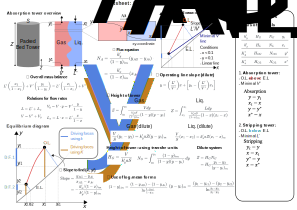
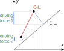
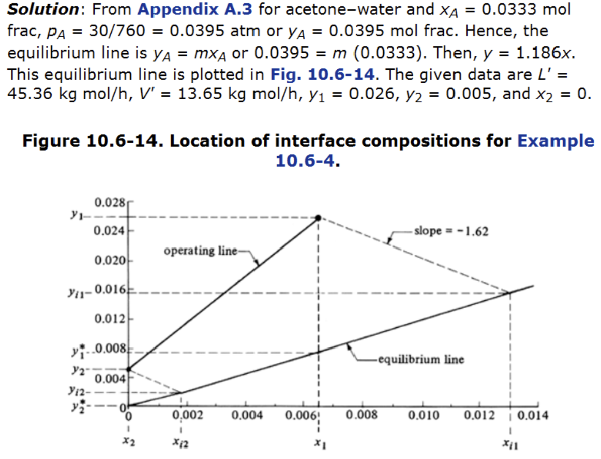

::: {.content-visible when-format="html" unless-format="revealjs"}

::: {.callout-note}
- Slides 👉  [Open presentation🗒️](./slides.html)
- PDF version of course note  👉 [Open in pdf](./L25.pdf)
- Handwritten notes 👉 [Open in pdf](./public/L25_annotated.pdf)
:::

:::


## Learning Outcomes {.center}

After today's lecture, you will be able to:

- Analysis of mass balance in two-phase column
- Recall expression for total tower height in column
- In depth critical analysis for the gas-liquid balance

## Cheatsheet for packed bed design



## Two-phase column: what have learned so far?

For two-phase mass transfer (solid-state packed bed, liquid-gas
absorption tower, etc.), our previous lectures have given:

:::{.columns}
:::{.column}

What we have learned

- Equilibrium diagram ✅
- Operating line (dilute) ✅
- Overall mass balance ✅
- Interfacial composition ✅

:::

:::{.column}

What are still missing

- Concentration profile ❓
- Height requirement ❓
- Non-linear operating line ❓

:::
:::

## In-depth analysis for packed absorption tower

Example goals:

- Analyze concentration profiles $x(z)$ and $y(z)$
- Design packed-bed height $z$

Solution:

- Take a differential element of height $dz$ 👉 differential equation
- Effective interfacial area: $A_{\text{eff}} = aSdz$
- Gas and liquid compositions both vary with $z$

## Mass balance on control volume $z \to z+dz$

Mass balance for control volume still holds:

```{=tex}
\begin{align}
\text{In}_{liq} + \text{In}_{gas}
=
\text{Out}_{liq} + \text{Out}_{gas}
\end{align}
```

Governing equation for a slab with thickness $dz$:

```{=tex}
\begin{align}
d(Vy)=d(Lx)
\end{align}
```

## Flux equation in each phase

The relation $d(Vy)=d(Lx)$ can be used to solve for each phase, if we
know how to connect with **flux equations** individually.

Take the gas-phase side, the effective contact area being $A_{\text{eff}}$
(see packed bed example in [Lecture 21](../L21)):

```{=tex}
\begin{align}
d(V y_{AG}) &= d(A_{\text{eff}}N_A) \\
&=
\frac{k_y'}{(1-y_A)_{im}}(y_{AG}-y_{Ai})aSdz
\end{align}
```

note we need to account for the non-linear concentration profile by
$y_{Bm} = (1-y_A)_{im}$ as discussed in last lecture.

## Governing differential equation for each phase

The part $d(V y_{AG})$ can be further simplified, because we know
$V = V' / (1 - y_{AG})$:

```{=tex}
\begin{align}
d(Vy_{AG}) &= d(V'\frac{y_{AG}}{1-y_{AG}}) \\
&= V' \frac{1}{(1 - y_{AG})^2} d y_{AG}
\end{align}
```

The final differential form in gas phase is then:

```{=tex}
\begin{align}
V'\frac{1}{(1-y_{AG})^2}dy_{AG}
=
\frac{k_y'aS}{(1-y_A)_{im}}(y_{AG}-y_{Ai})dz
\end{align}
```

## Differential equation for tower height

It is often desired to know the total height $Z$ for the tower given
operating line. We can integrate over the differential equation

```{=tex}
\begin{align}
Z
&=
\int_0^Z dz \\
&=
\int_{y_2}^{y_1}
\frac{V'}{k_y'aS}
\cdot
\frac{(1-y_A)_{im}}{(1-y_{AG})^2(y_{AG}-y_{Ai})}
\, dy_{AG}
\end{align}
```

- this is the **exact form** for the gas-side height profile
- we can obtain the same equation using liquid-side conditions
- numerical integration is needed

## Different forms of height equation

If we drop the subscript $A$, and use $V = V'/(1-y)$ & $L=L'/(1-x)$,
the height equation can be expressed in different forms

- Gas-side profile

$$
Z = \int_{y_2}^{y_1} \frac{V dy}{\frac{k'_y a S}{(1 - y)_{im}} (1 - y)(y - y_i)}
$$

- Liquid-side profile

$$
Z = \int_{x_2}^{x_1} \frac{L dy}{\frac{k'_x a S}{(1 - x)_{im}} (1 - x)(x_i - x)}
$$

:::{.callout-warning}
The order of interface composition differences in liquid $(x_i - x)$ and gas
$(y - y_i)$ have opposite signs!
:::

## Height equation using overall mass transfer coefficients

It is also possible to express the height equations using $K_y'$ or $K_x'$:

- Gas-side profile

$$
Z = \int_{y_2}^{y_1} \frac{V dy}{\frac{K'_y a S}{(1 - y)_{*m}} (1 - y)(y - y^*)}
$$

- Liquid-side profile

$$
Z = \int_{x_2}^{x_1} \frac{L dy}{\frac{K'_x a S}{(1 - x)_{*m}} (1 - x)(x^* - x)}
$$

:::{.callout-warning}
The order of pseudo-interface composition differences in liquid $(x^* - x)$ and gas
$(y - y^*)$ have opposite signs!
:::

## Simplified case: dilute system

The factors $k_x'a$, $k_y'a$, $K_x'a$, $K_y'a$ are usually not
constant, making the solution harder to obtain. We will consider a
simplified version of absorption of dilute gas.

- dilute regime: composition less than 0.1 (10 mol%)
- simplification 1: almost constant $V$ and $L$
- simplification 2: $(1-x)_{im}/(1-x)$ and $(1-y)_{im}/(1-y)$ are almost independent on the location
- simplification 3: change of $V$ (or $L$) over the column is minimal, usually use $V = (V_1 + V_2)/2$

## Height equation in dilute systems

- Gas-side profile (use $k'_y$)

$$
Z = \left[ \frac{V}{k'_y a S} \frac{(1 - y)_{im}}{1 - y} \right] \int_{y_2}^{y_1} \frac{dy}{y - y_i}
$$

- Liquid-side profile (use $k'_x$)

$$
Z = \left[ \frac{V}{k'_x a S} \frac{(1 - x)_{im}}{1 - x} \right] \int_{x_2}^{x_1} \frac{dx}{x_i - x}
$$

Replacing $_{im}$ subscript to $_{*m}$ and use overall coefficients will have another sets of equations.

## Further simplification: log mean driving force

In practical cases we can even let $\frac{(1 - y)_{im}}{1 - y} \approx
1$ and $\frac{(1 - x)_{im}}{1 - x} \approx 1$. The
R.H.S. becomes only dependent on $\int_{y_2}^{y_1} \frac{dy}{y -
y_i}$.

```{=tex}
\begin{align}
Z
&= \frac{V}{k_y'aS} \int_{y_2}^{y_1} \frac{dy}{y - y_i}
\frac{V}{k_y'aS}
\ln\left(\frac{y_1-y_i}{y_2-y_i}\right)
\end{align}
```

From the packed-bed analysis in [Lecture 21](../L21) we know it
corresponding to a log-mean driving force term $(y - y_i)_{m}$:

```{=tex}
\begin{align}
\frac{V}{S}(y_1-y_2)
&=
k_y'aZ
\frac{(y_1-y_i)-(y_2-y_i)}
{\ln\left(\dfrac{y_1-y_i}{y_2-y_i}\right)} \\
&= k_y' aZ (y - y_i)_{m}
\end{align}
```

## What does the result tell us?

Let's take a pause and check the meaning for the governing equation

```{=tex}
\begin{align}
\frac{V}{S}(y_1-y_2)
= k_y' aZ (y - y_i)_{m}
\end{align}
```

- L.H.S.: molar flow of A **absorbed** per column cross-sectional area
- R.H.S.: molar flow of A **transferred** from gas to liquid phase
  - _average_ driving force: log-mean of $y-y_i$
  - transfer coefficient: $k_y'$

## Visualization of log-mean driving force

For dilute gas system, the driving force can be visualized using
diagonal lines connecting the operating line and equilibrium line.



## Comparison: packed bed with solid spheres

The dilute two-phase system is very close to the packed bed of solid
spheres in [Lecture 21](../L21), see the side-by-side comparison.

:::{.columns}
:::{.column width="50%}

Packed bed of solid spheres

- Constant $c_{Ai}$
- **Uses log-mean driving force** of $c$

$$
Q(c_2 - c_1) = k_c' a H (c_i - c)_{m}
$$

:::

:::{.column width="50%}

Packed bed of liquid-gas

- Varying $y_i$
- **Uses log-mean driving force** of $y$

$$
\frac{V}{S}(y_1 - y_2) = k_y' a Z (y - y_i)_{m}
$$

:::
:::

## All forms of height equation in dilute system

- Gas, use $k_y'$

$$
\frac{V}{S}(y_1 - y_2) = k_y' a Z (y - y_i)_{m}
$$

- Liquid, use $k_x'$
$$
\frac{V}{S}(x_1 - x_2) = k_x' a Z (x_i - x)_{m}
$$

- Gas, use $K_y'$

$$
\frac{V}{S}(y_1 - y_2) = K_y' a Z (y - y^*)_{m}
$$

- Liquid, use $K_x'$
$$
\frac{V}{S}(x_1 - x_2) = K_x' a Z (x^* - x)_{m}
$$

## Example: calculate height of acetone absorption tower

(Example 10.6-4) Acetone is being absorbed by water in a packed bed
column having a cross sectional area of 0.186 m$^2$ at 293 K and 1
atm. The inlet air contains 2.6 mol% acetone and outlet contains
0.5%. The gas flow is 13.65 kg mol inert air per hour. The pure water
inlet flow is 45.36 kg mol water per hour. The coefficient $k_y' a$ is
estimated to be $3.78 \times 10^{-2}$ kg mol/(s·m$^3$) and $k_x' a$ is
$6.16 \times 10^{-2}$ kg mol/(s·m$^3$). The equilibrium line can be
approximated by

$$
y = 1.186 x
$$

a) calculate the tower height use $k_y' a$
b) repeat a) but use $k_x' a$
c) calculate the tower height use $K_y' a$

## Solution steps (1)

1) Is this system dilute (<10%)?

   Yes. Choose linear operating line and height equation

2) Determine two ends of the operating line

- Point 1: $x_1$=?; $y_1=0.026$
- Point 2: $x_2=0$; $y_2=0.005$

3) Calculate $x_1$?

Use mass balance equation


## Solution steps (2)

4) Find the slope of curve



## Solutions steps (3)

5) To use the height equation

$$
\frac{V}{S}(y_1 - y_2) = k_y' a Z (y - y_i)_{m}
$$

- total flow rate $V=\frac{V_1 + V_2}{2}\approx 3.852 \times{} 10^{-3}$ kg mol/s
- log-mean driving force

$$
(y - y_i)_{m} = \frac{(y_1 - y_i) - (y_2 - y_i)}{\ln (\frac{y_1 - y_i}{y_2 - y_i})} = 0.006
$$

Final result: $Z=1.911$ m


## Summary

- Solving single-phase mass balance in absorption packed tower
- Use dilute solution for tower height analysis
- Recall the analog between the solid sphere packed bed and liquid-gas tower


$$
(1 - y)_{im} = \frac{(1 - y_{AG}) - (1 - y_{Ai})}{\ln\! \frac{1 - y_{AG}}{1 - y_{Ai}}}
$$

$$
(y - y_i)_{m} = \frac{(y_{1} - y_{i1}) - (y_{2} - y_{i2})}{\ln\! \frac{y_{1} - y_{i1}}{y_2 - y_{i2}}}
$$


