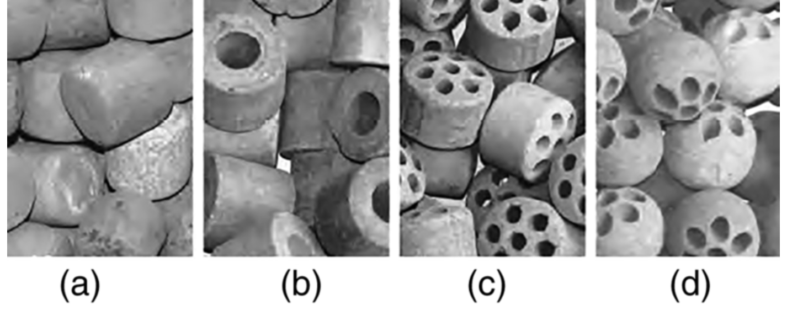
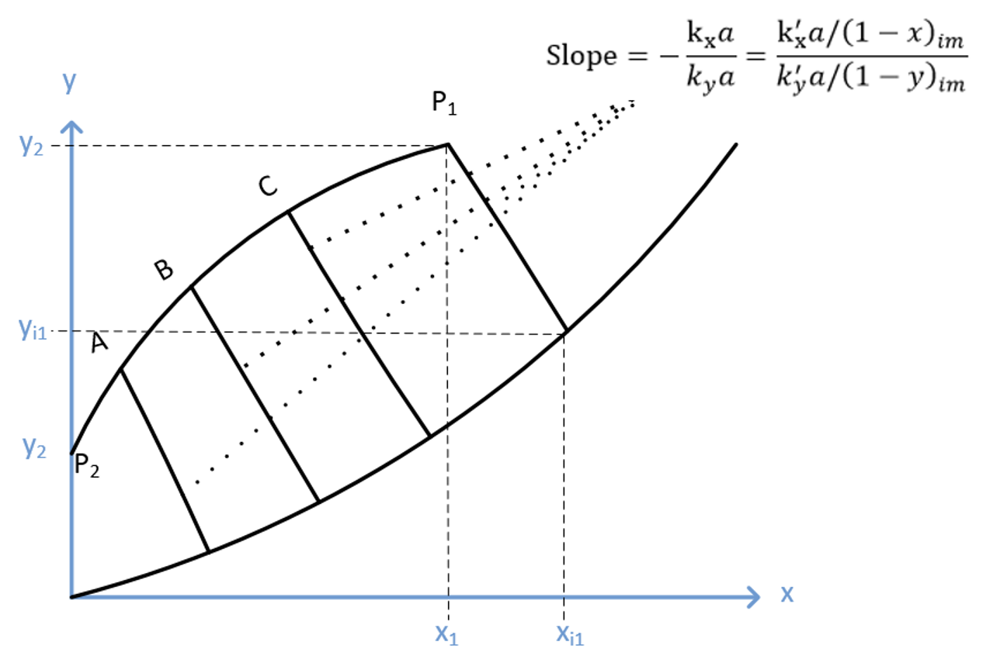
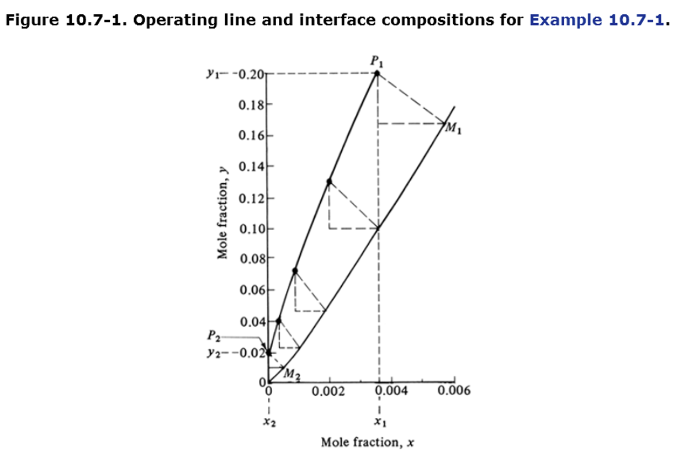
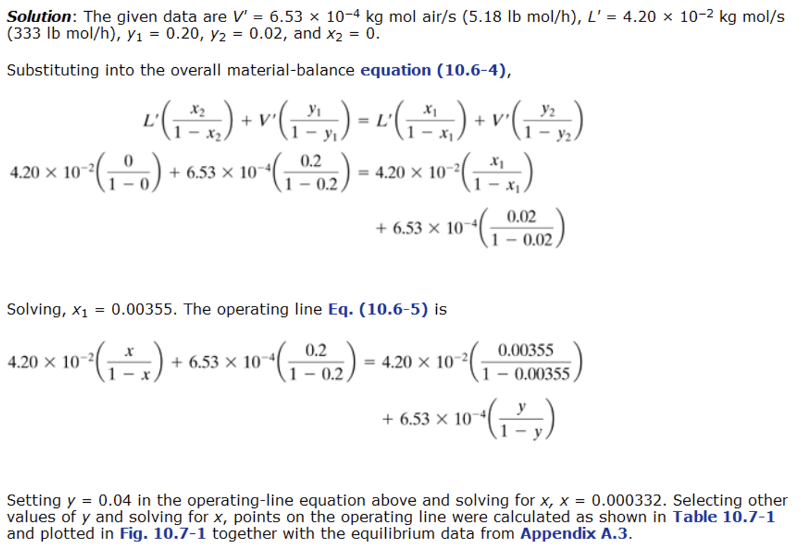
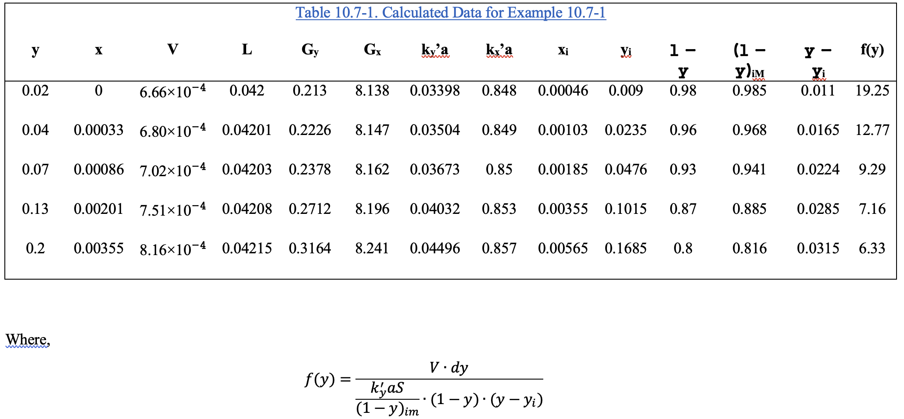

::: {.content-visible when-format="html" unless-format="revealjs"}

::: {.callout-note}
- Slides 👉  [Open presentation🗒️](./slides.html)
- PDF version of course note  👉 [Open in pdf](./L26.pdf)
- Handwritten notes 👉 [Open in pdf](./public/L26_annotated.pdf)
:::

:::


## Learning Outcomes {.center}

After today's lecture, you will be able to:

- Review general procedure of designing a packed tower in arbitrary concentration conditions
- Recall the concepts of transfer unit and number of units in packed bed design
- Understand the process of solving the tower height in realistic concentration profiles


## Recall: packed tower height equation (individual phase)

General equation for gas. What the meanings for each term?

```{=tex}
\begin{align}
Z
&=
\int_{y_2}^{y_1}
\frac{V'}{k_y'aS}
\cdot
\frac{(1-y)_{im}}{(1-y)^2(y-y_{i})}
\, dy \\
&= \int_{y_2}^{y_1}
\frac{V}{k_y'aS}
\cdot
\frac{(1-y)_{im}}{(1-y)(y-y_{i})}
\, dy
\end{align}
```

## Recall: height equation for diluted system

If $x<0.1$ and $y<0.1$, typically use (for gas phase):

$$
Z = \left[ \frac{V}{k'_y a S} \frac{(1 - y)_{im}}{1 - y} \right] \int_{y_2}^{y_1} \frac{dy}{y - y_i}
$$

or even simpler

$$
Z = \left[ \frac{V}{k'_y a S} \right] \int_{y_2}^{y_1} \frac{dy}{y - y_i}
$$

what insights can we get?

## Motivation: transfer units for packed beds

From unit analysis, the term $\frac{V}{k'_y a S}$ characterizes the
height. We often use the concept of **transfer unit** to determine the
performance of mass transfer in each phase. For gas phase, we have the
"height" of the transfer unit $H_G$ as

```{=tex}
\begin{align}
H_G = \frac{V}{k_y' a S}
\end{align}
```

- $H_G$ is controlled by ratio of flow rate and mass transfer in gas phase
- smaller $H_G$ means more efficient packing (thus needing shorter tower)

## Define the number of transfer units

The rest of the equation for $Z$ can be rewritten as "number of
transfer units", similar to theoertical number of trays in a tray
tower. For gas phase general case, we have

```{=tex}
\begin{align}
N_G
=
\int_{y_2}^{y_1}
\frac{(1-y)_{im}}{(1-y)(y-y_i)}
\,dy
\end{align}
```

For dilute system, we can approximate $N_G$ by

```{=tex}
\begin{align}
N_G &= \int_{y_2}^{y_1}
\frac{dy}{y-y_i} \\
&= \frac{y_1 - y_2}{(y - y_i)_m}
\end{align}
```

## Transfer unit view of packed bed

For dilute system, we can see that

```{=tex}
\begin{align}
Z &= H_G N_G \\
  &= H_G \frac{y_1 - y_2}{(y - y_i)_m}
\end{align}
```

- Total height $Z$ is a stack of "transfer units" with height $H_G$
- Number of the units is governed by the total absorption $(y_1 - y_2)$ and driving force $(y - y_i)_m$
- Need to absorb more (larger $(y_1 - y_2)$)? 👉 higher tower
- Operation line close to equilibrium? 👉 higher tower

## Example 1: packed bed height estimation using transfer units

Similar example in [Lecture 24](../L24), Acetone is being absorbed by
water in a packed bed column having a cross sectional area of 0.186
m$^2$ at 293 K and 1 atm. The inlet air contains 2.6 mol% acetone and
outlet contains 0.5%. The gas flow is 13.65 kg mol inert air per
hour. The pure water inlet flow is 45.36 kg mol water per hour. The
coefficient $k_y' a$ is estimated to be $3.78 \times 10^{-2}$ kg
mol/(s·m$^3$) and $k_x' a$ is $6.16 \times 10^{-2}$ kg
mol/(s·m$^3$). The equilibrium line can be approximated by $y = 1.186 x$.

a) Now calculate the height using the dilute regime equation
b) Now calculate the height using $H_G$ and $N_G$ statements

## Example 1 diagram


## Example 1 solution

Key numbers during calculation:

1. Liquid outlet $x_1 = 0.00648$
2. $(1 - y)_{im} \approx (1 - x)_{im} \approx 1$ 👉 use dilute regime is justified
3. $(y - y_i)_{m} = 0.00602$
4. Average $V = (V_1 + V_2)/2 =3.852 \times 10^{-3}$ kg mol/s

Final results:

1. $Z=1.911$ m
2. $H_G=0.548$ m, $N_G=3.488$

## Practical estimation of $k_y’ a$ or $H_G$

In real packed beds, coefficients are often obtained from correlations (using dimensionless numbers etc), which may depend on:


- $N_{Re}$, $N_{Sc}$
- Weight flow rates $G_y$, $G_x$
- Packing type (shape? diameter?)



## Design of packed bed in realistic situations

In many industrial applications, engineers are either interested in
one of the approach to estimate the desired tower height:

1. Estimate the correlation of $k_y' a$ and $k_x' a$ as functions of $G_x$ and $G_y$

$$
k_y'a = f_y(G_x, G_y, \text{pack type});\quad k_y'a = f_x(G_x, G_y, \text{pack type})
$$

2. Estimate $H_G$ (and / or $H_L$) from the correlation

$$
H_G = f_G(G_x, G_y, N_{Sc}, \text{pack type})
$$

Either way, the flow rates are locally dependent, so integration should be used. Let's a detailed  example from textbook.

## Example 2: concentrated packed bed design

(Example 10.7-1) A tower packed with 25.3 mm ceramic rings is used to
absorb SO$_2$ from aire using pure water at 293 K and 1 atm. The
entering gas contains 20 mol% SO$_2$ and leaving gas has 2 mol%. The
inert air flow is $6.53\times10^{-4}$ kg mol/s and inlet water flow is
$4.20\times10^{-2}$ kg mol/s. Cross sectional area of the tower is
0.0929 m$^2$. From literature, the film mass transfer coefficients are estimated as

$$
k_y' a = 0.0594 G_y^{0.7} G_x^{0.25} \qquad  k_x' a = 0.152 G_x^{0.82}
$$

where $G_x$ and $G_y$ are total weight of liquid / gas flow per second per area, respectively. Estimate the tower height needed.

## Example 2: steps?

We have seen $y_2 = 0.2$, so in general the dilute solution is not
accurate. Use the following steps instead:

1. **At each point** on the operating line: determine $(x,y)$
2. Use local flow rates $V_y$, $L_x$ to find
   - $G_y = M_{\text{air}} V' + M_{A}V_y$
   - $G_x = M_{\text{water}} L' + M_{A}V_x$
3. Calculate $k_y' a$ and $k_x' a$ for each point 
4. Use trial-and-error / numerical method to determine $(x_i,y_i)$
5. Integrate through the bed to get $Z$

## Notes on the integration

The height equation is basically integration of a function $f(y)$ over the column. Manual integration using trapezoidal rule usually require at least 5 points along $y$

```{=tex}
\begin{align}
Z &= \int_{y_2}^{y_1} \frac{V dy}{\frac{k'_y a S}{(1 - y)_{im}} (1 - y)(y - y_i)} \\
  &= \int_{y_2}^{y_1} f(y) dy \\
  &= \sum_{j=0}^{n-1} [f(y_j) + f(y_{j + 1})] \frac{y_{j+1} - y_{j}}{2}
\end{align}
```



## Example 2: operating line



## Example 2: textbook solutions (1)



## Example 2: textbook solutions (2)



Final integration result: $Z = 1.588$ m


## Summary

In this lecture we have seen how the height of a realistic packed bed
tower is calculated and how to obtain relative statements using the
transfer unit concepts.

In next weeks, we will talk about the final topic: mass transfer
coupled with heat transfer. One useful example will be the
humidification tower. 


