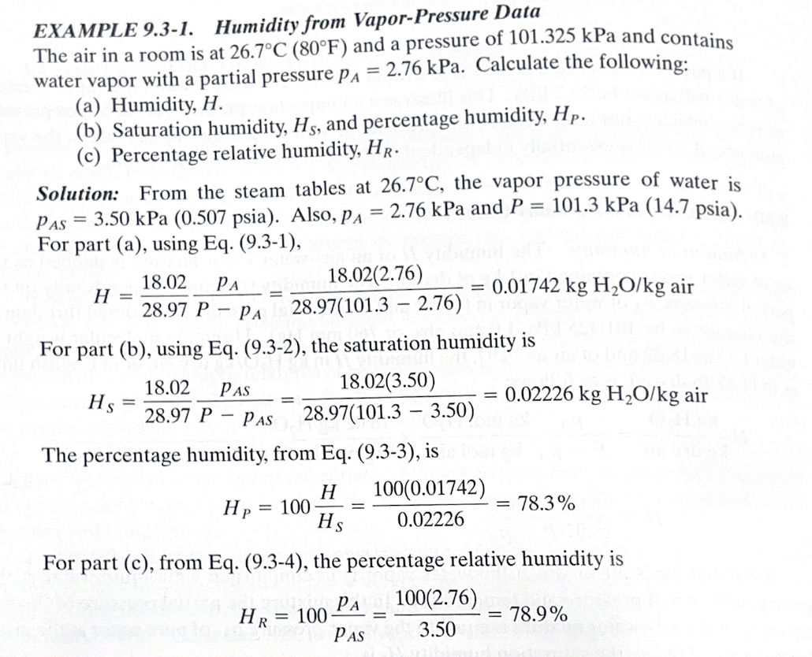
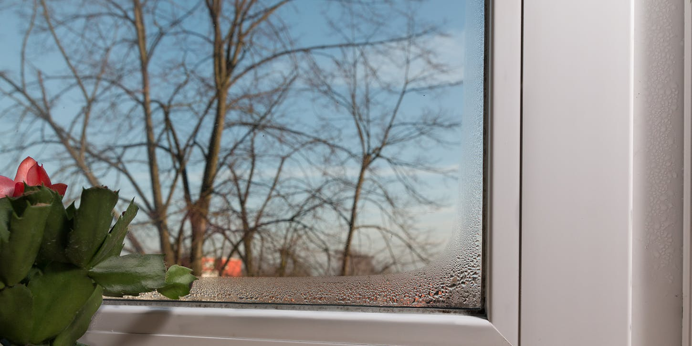
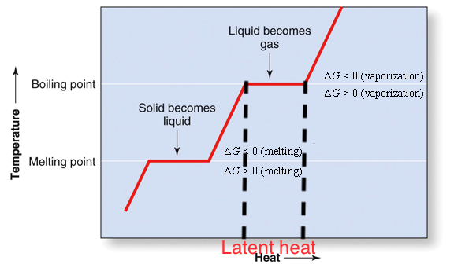
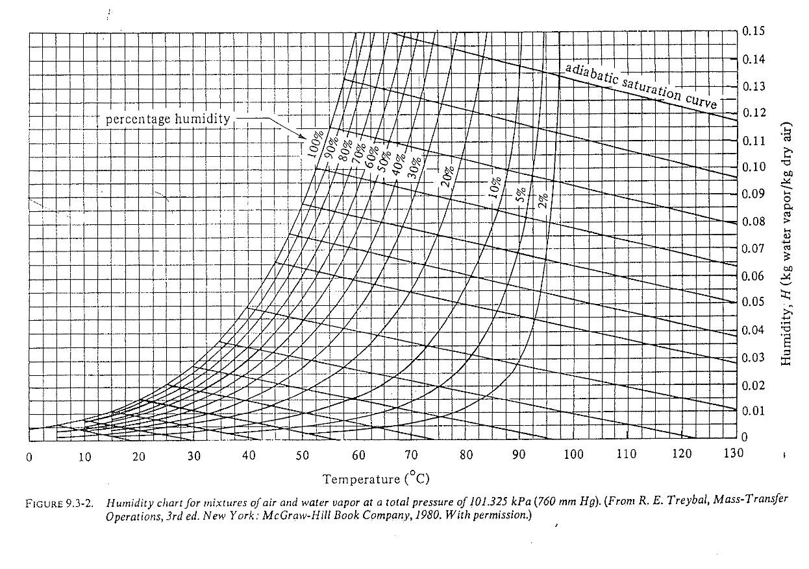
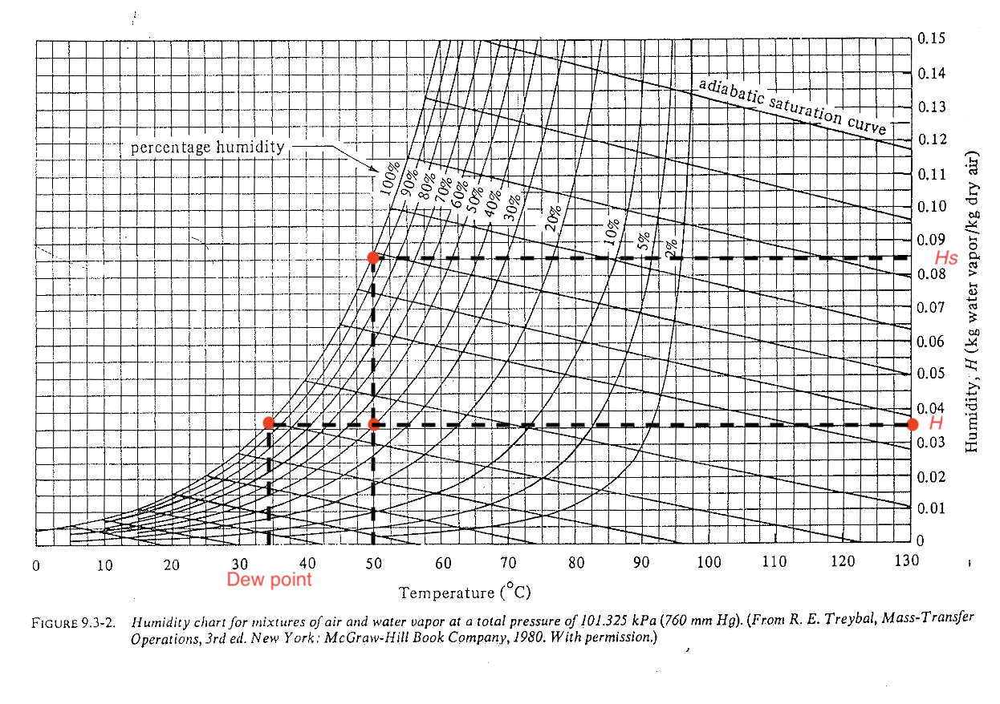

::: {.content-visible when-format="html" unless-format="revealjs"}

::: {.callout-note}
- Slides 👉  [Open presentation🗒️](./slides.html)
- PDF version of course note  👉 [Open in pdf](./L27.pdf)
- Handwritten notes 👉 [Open in pdf](./public/L27_annotated.pdf)
:::

:::


## Learning Outcomes {.center}

After today's lecture, you will be able to:

- Recall fundamental knowledge about humidity 
- Understand the different ways of expressing water contentin air
- Analyze the temperature dependency of humidity
- Understand the arise of enthalpy and latent heat in water-air system

## Humidification process: why is it relevant?

Edmonton's winter is harsh! How do we make our home more humid?

](./public/reddit-post-humidity.png)

## The humidification process: two-phase mass & heat transfer

In order to increase the humidity in a room during Edmonton's harsh
winter, you decide to buy a humidifier. Your knowledge from the CHE
318 course may actually be helpful! A few questions to think about:

- What is humidity, anyway?
- Types of humidifiers available?
- How does each of them work?
- Is it efficient for my use scenario?

## Humidifiers: how do they work?

- What is the common feature? Increase water content in air
- Can you use mass transfer concepts to explain their mechanism?

](./public/humidifier.png)

## Concept 1: humidity

**Humidity** $H$ (an absolute value)

- Definition: kg of water vapor per kg dry air at certain temperature

- For water-air systems where mole weights are $M_A$ and $M_B$, respectively, also link to partial pressure $p_A$

$$
H = \frac{M_A p_A}{M_B(p_T-p_A)}
$$

- For air-water, can simply as

$$
H = 0.622\frac{p_A}{p_T-p_A}
$$

## Concept 2: saturation vapour pressure and saturation humidity

At each temperature $T$, at equilibrium water-air interface, the
pressure is **saturation vapour pressure** $p_{\mathrm{vap}}$. The
(absolute) humidity at this partial pressure is the **saturation humidity** $H_s$:

$$
H_s = 0.622\frac{p_{\mathrm{vap}}}{p_T-p_{\mathrm{vap}}}
$$

## Concept 3: percent humidity and relative humidity

These two are often confused with each other so treat with caution.

- **Percent humidity**, percentage of current humidity $H$ with respect to saturation humidity $H_s$
  - Often appear in ChemE textbooks and charts: easy to calculate with $H$

$$
H_p = \left(\frac{H}{H_s}\right) \times 100\%
$$

- **Relative humidity**: percentage of current partial pressure $p_A$ with respect to (saturation) vapour pressure $p_{\mathrm{vap}}$
  - The actual one used in household humidity sensor (also called R.H.)

$$
H_R = \left(\frac{p_A}{p_{\mathrm{vap}}}\right) \times 100\%
$$


$H_p$ and $H_R$ are generally not the same. The approximation $H_p \approx H_R$ only applies at low humidity.

## Relationship between $H_p$ and $H_R$

Using the ideal gas law, it can be shown that

```{=tex}
\begin{align}
H_p &= \frac{p_A}{p_{\text{vap}}} \frac{p_T - p_{\text{vap}}}{p_T - p_A} \\
    &= H_R \frac{p_T - p_{\text{vap}}}{p_T - p_A}
\end{align}
```

Since $p_A \leq p_{\text{vap}}$, we can show that $H_p \leq H_R$ always holds.

## Example of percentage / relative humidity calculation




## Concept 4: dew point

**Dew point**: temperature at which the vapor in air just becomes saturated / condensed.


At dew point, $p_A = p_{\mathrm{vap}}(T_{\mathrm{dew}})$

- Lower dew point means drier air (compared with current temperature $p_{\text{vap}}$




## Concept 5: humid heat

**Humid heat** $c_s$: heat required to raise $1$ kg _dry air_ plus its
  associated vapor by $1$ K. Think of it as the specific heat / heat
  capacity for air-water mixture.


For air-water, when dry air and water vapour have heat capacities $c_B$ and $c_A$, respectively, the humid heat is

$$
c_s = c_B + Hc_A
$$

Useful relation to remember:

$$
c_s = 1.005 + 1.88H\quad \text{[kJ/(kg dry air K)]}
$$


## Heat required for a humid gas stream

The relation for $c_s$ tells us that heating up a gas stream for humid
air requires more energy than drier one. For a stream containing dry
air and water vapor, such heat is:

$$
Q = w_B c_s \Delta T
$$

where $w_B$ is mass flow rate of dry air in kg / s. Note such energy
is usually called **sensible** heating of the gas-vapor mixture,
because it is directly proportional to $\Delta T$.


## Concept 6: Humid volume

**Humid volume** $v_H$: volume occupied by $1$ kg dry air plus its
  associated water vapor at certain pressure. (This is less useful
  than other quantities for cooling process).


At 1 atm:

$$
v_H = \frac{22.41}{273}\left(\frac{1}{28.97}+\frac{H}{18.02}\right)T
$$

At general pressure:

$$
v_H = \left(\frac{1}{28.97}+\frac{H}{18.02}\right)\frac{22.41}{273}T\left(\frac{1.013\times 10^5}{p_T}\right)
$$

where $T$ is in Kelvin, $p_T$ is in Pa, and $v_H$ is in m$^3$. 


## Concept 7: enthalpy of humid air

Humid air **enthalpy** $H_y$ includes:

- **sensible heat** of dry air and vapor: proportional to $\Delta T$
- **latent heat** carried by water vapor: caused by phase-change, $T$ remains the same



## Enthalpy of humid air: general form:

- Usually written as $H_y$ (not to be confused with other forms of humidity $H$, $H_p$ and $H_R$).
- Unit: kJ / kg dry air
- Enthalpy is a _relative_ quantity, so a reference temperature $T_0$ should be used (usually $T=0\ ^{\circ}\mathrm{C}$)

$$
H_y = c_s(T-T_0) + H\lambda_0
$$

For air-water with $T_0=0^\circ\mathrm{C}$, and $T$ uses Celcius:

$$
H_y = (1.005 + 1.88H)T + 2501.4H\quad \text{[kJ/kg dry air]}
$$

## Everything at one place: the humidity / psychrometric chart

Psychrometric: greek for _psychro_ (cold) + _metric_ (measure), relating to the measurement of temperature drop when water evaporates.



## Reading the humidity / psychrometric chart (level 1)

Find where $H$, $H_p$, dew point $T_{\tex{dew}}$ are?



## Example 2: humidifier design

A living room of 60 m$^2$ at 22 $^\circ$C has a relative humidity of
20% due to continuous heating. Your and your roomate wish to purchase
a humidifer that can humidify the living room up to 45% relative
humidity. Assume the floor-ceiling distance is 3 m, calculate the
weight of water needed to humidify the whole room. Can you use the
humidity chart to estimate?

## Example 2: steps

1. Read the saturation vapour pressure from $H_s$ ($H_s = 0.017$)

```{=tex}
\begin{align}
H_s &= 0.622 \frac{p_{\text{vap}}}(p_T - p_{\text{vap}}) = 0.017 \\
p_{\text{vap}} &= 2.69\ \text{kPa}
\end{align}
```

from the vapour data it gets $p_{\text{vap}} = 2.64$ kPa, pretty close!

2. Estimate weight of water $\Delta m_A$

```{=tex}
\begin{align}
\Delta m_A &= \frac{\Delta p_A V M_A}{RT} \\
           &=  \frac{(H_{R1} - H_{R0}) p_{\text{vap}} V M_A}{RT} \\
	   &\approx 0.87\ \text{kg}
\end{align}
```

Does it make sense? The requirement for water tank will be a lower bound.

## Mythbusting time (1)

My weather app shows that outside is $-12\ ^\circ$C and R.H. is 74%, whene the dew point is $-16\ ^\circ$C. What does all that mean?

:::{.callout-tip}
A useful note is that the **lower** dew point is
compared with current temperature, the **drier** air appears to be
:::

## Mythbusting time (2)

In the previous scenario $-12\ ^\circ$C and R.H. is 74%,  when I open the door, my humidity in home immediately drops! Why?

- The calculated $H_R$ at room temperature is only 6.7% if fully filled with outside air.

:::{.callout-tip}
$H_R$ (or R.H.) only measures up at current temperature. When moving water content at different $T$, $H_R$ will change. 

- cold air 👉 appears to be dry at high T
- warm air 👉 appears to be humid at low T
:::

## Mythbusting time (3)

Why does "humid hot" environment feels much hotter than "dry hot" environment, even if the apparent $T$ is the same?

- Calculate the enthalpy of air-water mixture, $H_y$ significantly increases when relative humidity is high!
- Human body relies on cooling to survive. At high $T$ high $H_R$, both driving forces for evaporation are reduced:
  - $T_{\text{body}} - T_{\text{env}}$ becomes small 👉 bad dissipation
  - $p_{A, \text{body}} - p_{A, \text{env}}$ becomes small  👉 evaporation suppressed

:::{.callout-tip}
The sensible specific heat for air-water mixture does not change significantly, even if water vapour's heat capacity is higher. (absolute $H$ is always 0.1 when $T<50\ ^\circ$C)
:::


## What to learn next

In industrial applications, evaporation of water into vapour is used
to cool hot liquid. We will discuss in detail how to solve this using
the concept of enthalpy in next lecture.👉


## Summary

- Demistifying the humidifaction process: it's just mass transfer + heat transfer
- General concepts in humidification
- Different forms of humidity
- Humidity-dependent enthalpy and use of humidity chart


