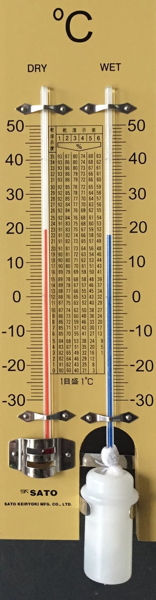
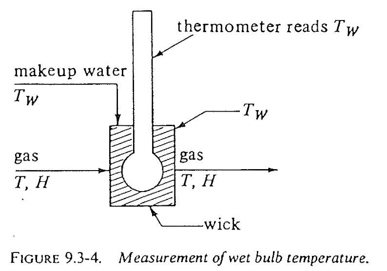
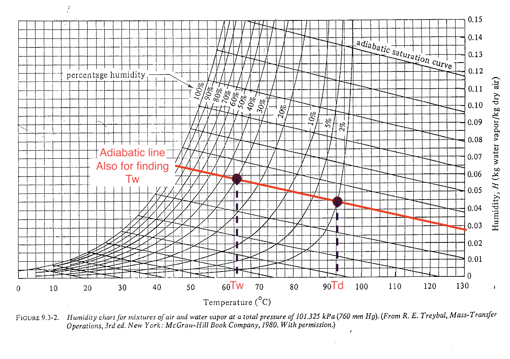
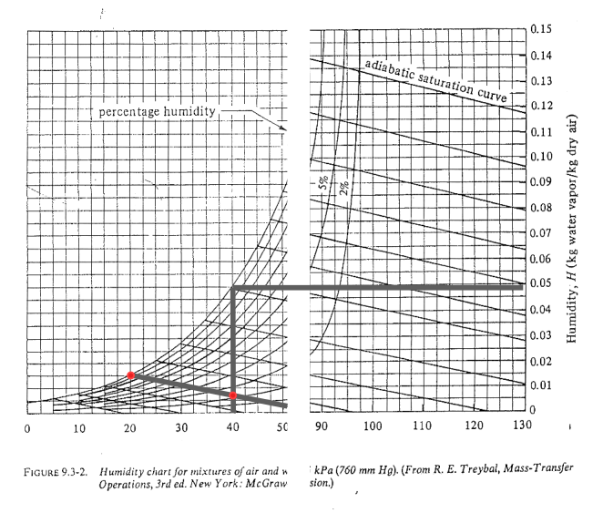

::: {.content-visible when-format="html" unless-format="revealjs"}

::: {.callout-note}
- Slides 👉  [Open presentation🗒️](./slides.html)
- PDF version of course note  👉 [Open in pdf](./L28.pdf)
- Handwritten notes 👉 [Open in pdf](./public/L28_annotated.pdf)
:::

:::


## Learning Outcomes {.center}

After today's lecture, you will be able to:

- Recall the process describing the evaporation process
- Analyze the enthalpy relation during evaporation
- Understand the origin of latent heat, wet-bulb temperature
- Recall steps to read the psychrometric chart on the adiabatic saturation curve

## Cheatsheet for Humidification Process


## Measuring Humidity: The Two-Bulb Hygrometer

:::{.columns}
:::{.column width="80%"}

Before electronic sensors, humidity was measured using a **two-thermometer setup**

- One thermometer measures **dry-bulb temperature** $T_d$
- The second thermometer is wrapped with a **wet wick** and measures **wet-bulb temperature** $T_w$ ($T_w < T_d$)

:::

:::{.column width="20%"}

{height="500px"}

:::
:::


## What Does the Wet Bulb Tell Us?

The wet bulb is a **steady state** evaporative cooling experiment, which can be generalized for interfacial evaporation problem:

- In and outlet temperatures are the same, while outlet humidity is higher
- Evaporation consumes **latent heat**





## Concept of Wet-Bulb Temperature

- The wet-bulb temperature $T_w$ is the temperature reached by a **wet surface exposed to air**

$$
T_w < T_d
$$

- $T_d$ = dry-bulb temperature  
- $T_w$ = wet-bulb temperature
- The difference between $T_w$ and $T_d$ indicates the inlet air humidity


## Moist Air Enthalpy

From [Lecture 27](../L27), the specific enthalpy of moist air can be written as

```{=tex}
\begin{align}
H_{y} = (1.005 + 1.88H)(T - T_0) + 2501.4H
\end{align}
```

- Increase the absolute humidity $H$ must cause $H_y$ to increase 👉
gas phase takes heat from liquid.
- Solving the heat + mass balance will give solution to $T_w$.

## Heat Balance Around the Wet Bulb

Consider the control volume around the wet bulb. Heat transferred from
the air is used to evaporate water, linked by the heat-mass balance (need a bit prerequisite in heat transfer):

```{=tex}
\begin{align}
q = M_A \lambda_w A N_A
\end{align}
```

- $m_A$: molecular weight of water
- $\lambda_w$: latent heat of vaporization at $T_w$ (44045 kJ/kg mol at 1 atm)
- $A$: area of the wetted surface
- $N_A$: molar flux of evaporating water


## R.H.S.: Mass Transfer at the Interface

The evaporation rate can be written as

```{=tex}
\begin{align}
N_A = k_y (y_w - y)
\end{align}
```

- $k_y$: gas-phase mass transfer coefficient (since $y_{BM} \approx 1$, $k_y \approx k_y'$)
- $y_w$: vapor mole fraction at the interface (saturated at $T_w$)
- $y$: vapor mole fraction in bulk air


## Converting Humidity to Mole Fraction

We can further change $y$ to the humidity $H$ for dilute system. Since humidity is define as weight ratio:

```{=tex}
\begin{align}
H = \frac{\text{kg }H_2O}{\text{kg dry air}}
\end{align}
```

The mole fraction of vapor is

```{=tex}
\begin{align}
y = \frac{H/M_A}{1/M_B + H/M_A}
\end{align}
```

Since humidity is typically small

```{=tex}
\begin{align}
y \approx \frac{M_B}{M_A}H
\end{align}
```


## L.H.S. Heat Transfer to the Wet Surface

The heat flux $q$ in L.H.S. from the air to the wet surface is

```{=tex}
\begin{align}
q = h (T - T_w) A
\end{align}
```

where $h$ is heat transfer coefficient in the Fourier's law $q = -h \Delta T$

## Wet-Bulb Setup: Final Results

Combining heat transfer ($q$) and mass transfer ($N_A$) relations gives

```{=tex}
\begin{align}
\frac{H - H_w}{T - T_w}
=
- \frac{h}{M_B k_y \lambda_w}
\end{align}
```

Note $\frac{H - H_w}{T - T_w}$ means the slope of a line on the
psychrometric chart. The slope is almost identical to **adiabatic line**!

## Psychrometric chart: adiabatic line

The $(T_d, H_{\text{in}})$ and $(T_w, H_{\text{out}})$ points are
along the adiabatic line (no external heat exchange). For water-air system, the adiabatic line and cooling line are very close and often not distinguished.



## Deeper Look Into The Cooling Process (1)

What does the adiabatic line tells us? It is basically a process that
each point has the same humid enthalpy, and no change of heat to external system:

$$
H = c_s (T - T_0) + H \lambda_0 = \text{[Const]}
$$

- Increase humidity ➡ decrease $T$
- Lowest temperature can reach in the system at certain $H_{\text{out}}$ is $T_w$
- Lowest temperature can reach when air is saturated is $T_s$

##  Deeper Look Into The Cooling Process (2)

For water-air, one handy property is that

$$
\frac{h}{M_B k_y} \approx 1.005 \approx c_s \qquad \text{[kJ / kg air]}
$$

such relation allows us to use the humidity chart's adiabatic saturation curve.

:::{.callout-warning}
Such simplification may not be applicable for other liquid, such as benzene!
:::

## Humidity Chart Example

Determine using the psychrometric chart for a humid air at $40^\circ$ that has a wet-bulb temperature of 20 $^\circ$:

- humidity $H$
- percent humidity $H_p$
- dew point $T_{\text{dew}}$
- humid heat $c_s$
- enthalpy $H_y$

:::{.callout-tip}
The big difference between $T_d$ and $T_w$ must indicate a low relative humidity
:::

## Humidity Chart: Steps

- $y-axis$ readout: $H \approx 0.0065$



## Humidity Chart: Results

- $H_p \approx 13\%$
- (optionally) $H_R \approx 14 \%$ ($H_R > H_p$)
- Dew point: $\approx 8^\circ C$
- Humid heat: $c_s \approx 1.02$ kJ / kg dry air
- Enthalpy: $H_y \approx 57$ kJ / kg dry air

## What Does Wet-Bulb Temperature Indicate?

- The wet-bulb temperature represents (when saturated) the **maximum
cooling** achievable by evaporation, and it not confined to the wet-bulb setup.

- The evaporation process is driven by vapor pressure difference
(y-difference in psychrometric chart)

```{=tex}
\begin{align}
p_{sat}(T_w) - p_A
\end{align}
```

- Applicable to:
  1. cooling towers
  2. evaporative cooling systems
  3. humidification process

##  What to Learn Next

The wet-bulb experiment connects **heat transfer** and **mass
transfer**, and the evaporation rate depends on the **vapor pressure
driving force**.

Next topics we will study:

- Gas-phase mass transfer during evaporation
- Interfacial equilibrium between water and air
- Driving force expressed as $(y_w - y)$ or $(p_{sat} - p_A)$


## Summary

- Reading humidity chart for cooling process
- Wet-bulb temperature and its origin
- Calculation of humidity values from the chart + equation


