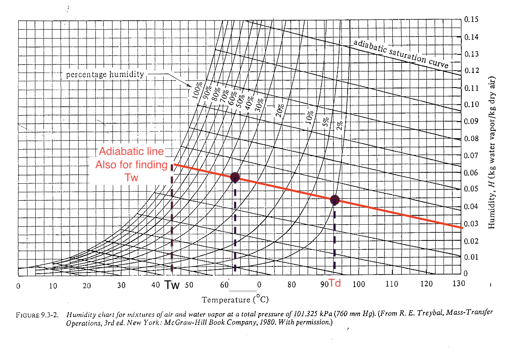
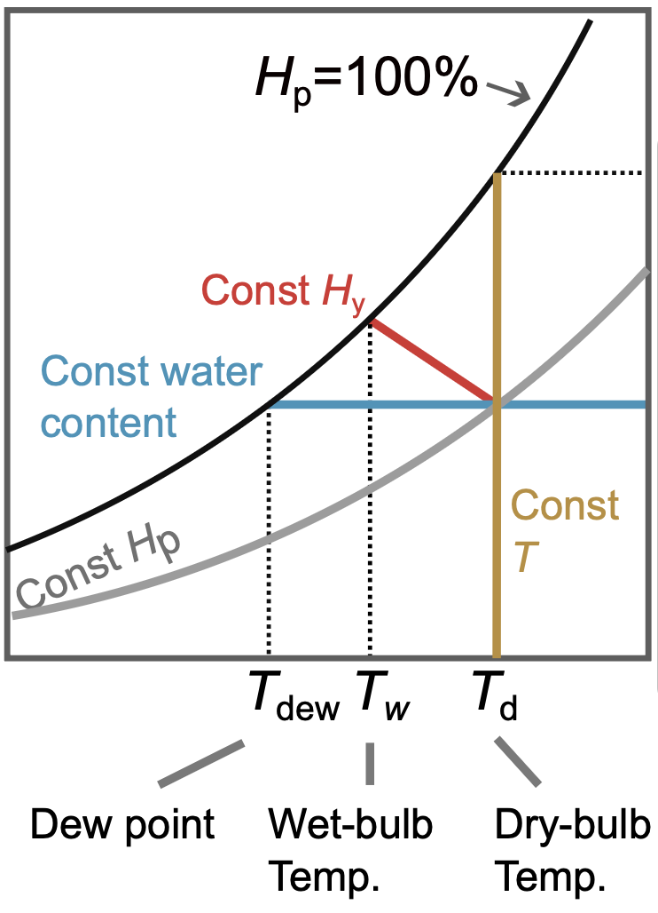
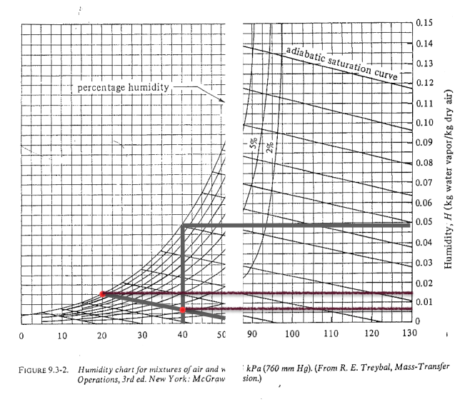
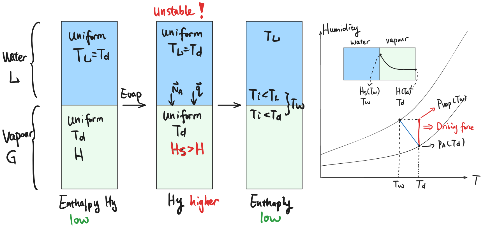
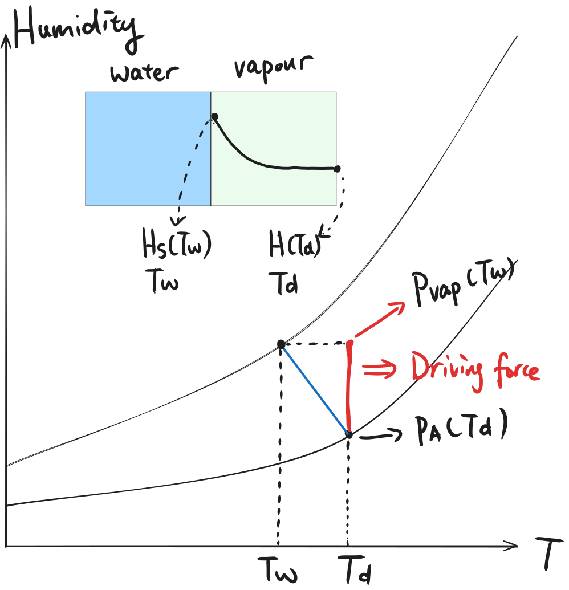
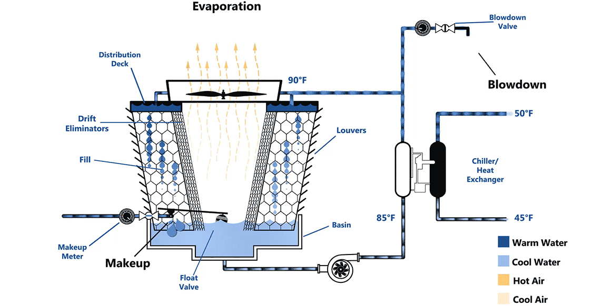
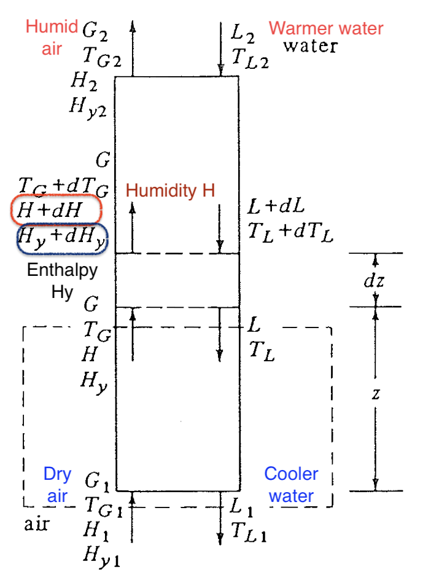

::: {.content-visible when-format="html" unless-format="revealjs"}

::: {.callout-note}
- Slides 👉  [Open presentation🗒️](./slides.html)
- PDF version of course note  👉 [Open in pdf](./L29.pdf)
- Handwritten notes 👉 [Open in pdf](./public/L29-L32_annotated.pdf)
:::

:::


## Learning outcomes {.center}

After this lecture, you will be able to:

- **Apply** psychrometric relations and charts to practical humidification problems.
- **Describe** the coupled heat- and mass-transfer mechanisms in cooling towers.
- **Compare** cooling-tower analysis with absorption-tower analysis.

## Cheatsheet for humidification process


## Recall: slope of the adiabatic line

Combining heat transfer ($q$) and mass transfer ($N_A$) relations gives

```{=tex}
\begin{align}
\frac{H - H_w}{T - T_w}
=
- \frac{h}{M_B k_y \lambda_w}
\end{align}
```

Note $\frac{H - H_w}{T - T_w}$ means the slope of a line on the
psychrometric chart. The slope $\approx 1.005$ is almost identical to **adiabatic line**!

## Psychrometric chart: adiabatic line (level 2)

The $(T_d, H_{\text{in}})$ and $(T_w, H_{\text{out}})$ points are
along the adiabatic line (no external heat exchange). For water-air system, the adiabatic line and cooling line are very close and often not distinguished.




## Humidity chart example

Determine using the psychrometric chart for a humid air at $40^\circ$ that has a wet-bulb temperature of 20 $^\circ$:

:::{.columns}
:::{.column width="50%"}

- humidity $H$
- percent humidity $H_p$
- dew point $T_{\text{dew}}$
- humid heat $c_s$
- enthalpy $H_y$

:::

:::{.column width="50%"}
{height="600px"}
:::

:::

:::{.callout-tip}
The big difference between $T_d$ and $T_w$ must indicate a low relative humidity
:::

## Humidity chart: steps

- $y$-axis readout:
  - $H(40\ ^\circ{}\text{C}) \approx 0.0065$
  - $H_s(20\ ^\circ{}\text{C}) \approx 0.0147$



## Humidity chart: results

- $H_p \approx 13\%$
- (optionally) $H_R \approx 14 \%$ ($H_R > H_p$)
- Dew point: $\approx 8^\circ C$
- Humid heat: $c_s \approx 1.02$ kJ / kg dry air
- Enthalpy: $H_y \approx 57$ kJ / kg dry air

## Deeper look into the cooling process (1)

What does the adiabatic line tells us? It is basically a process that
each point has the same humid enthalpy, and no change of heat to external system:

$$
H_y = c_s (T - T_0) + H \lambda_0 = \text{[Const]}
$$

- Increase humidity ➡ decrease $T$
- Lowest temperature can reach in the system at certain $H_{\text{out}}$ is $T_w$
- Lowest temperature can reach when air is saturated is $T_s$

##  Deeper look into the cooling process (2)

For water-air, one handy property is that

$$
\frac{h}{M_B k_y} \approx 1.005 \approx c_s \qquad \text{[kJ / kg air]}
$$

such relation allows us to use the humidity chart's adiabatic saturation curve.

:::{.callout-warning}
Such simplification may not be applicable for other liquid, such as benzene!
:::


## Thought experiment: why does water-vapour interfacial temp change?



## What does wet-bulb temperature indicate?

- The wet-bulb temperature $T_w$ represents (when saturated) the **maximum
cooling** achievable by evaporation, and it not confined to the wet-bulb setup.

- The evaporation process is driven by vapor pressure difference
(y-difference in psychrometric chart)

```{=tex}
\begin{align}
p_{sat}(T_w) - p_A
\end{align}
```
:::{.columns}
:::{.column width="50%"}

Applicable to:

- cooling towers
- evaporative cooling systems
- humidification process

:::

:::{.column width="50%"}
{width="450px"}
:::

:::

## Introduction to cooling tower

Chemical plants often uses water cooling tower for heat exchange. What is its mechanism?



## Some other geometry of a cooling tower

The iconic hyperboloid structure seen at many power plants is also a
cooling tower

:::{.callout-note}

A [youtube video](https://www.youtube.com/watch?v=tmbZVmXyOXM) explains the mechanism of cooling tower in detail, with some analysis of the psychrometric chart. Highly recommended.

:::


## Common features of a cooling tower

:::{.columns}
::: {.column width="50%"}
- Warm water enters from the top
- (Cool) air enters from the bottom
- Cooler water leaves at the bottom
- More humid air leaves at the top
:::

::: {.column width="50%"}
{width="400px"}
:::
:::

## Why does cooling happen?

- Dry air promotes evaporation
- Evaporation consumes latent heat
- Latent heat is supplied mainly by the liquid water
- Therefore the water temperature drops

## Why does evaporation occur?

At the water surface, vapor tends to leave the liquid if the interface
vapor pressure is higher than that in the bulk gas.

Driving force for
evaporation:

```{=tex}
\begin{align} p_{\mathrm{vap}}(T_i) - p_A(T_w) > 0
\end{align}
```

Direction of mass transfer $N_A$: water to air (opposite from absorption tower)

## Cooling tower as analog of absorption tower

Many topics from packed-bed absorption tower can be adapted in cooling tower:

1. What is the equilibrium line?
2. How to describe the operating line using the heat / mass transfer?
3. What are the design requirements?
4. Minimum flow rate?
5. Tower height?

## Question 1: what is the equilibrium line?

For the cooling tower, we're interested in both **humidity of gas**
and **energy transfer** at interface. Instead of using just
psychrometric chart ($H$ vs $T$), a better choice is plot the enthalpy
of gas phase $H_y$ vs the bulk temperature in liquid $T_L$.

## Question 2: what is the operating line?

Recall in the case of absorption packed-bed tower, we solved a mass
balance equation to describe operating line in the $x-y$ diagram. The
same applies to the cooling tower. An energy balance is used

```{=tex}
\begin{align}
\text{Energy}_{\text{In}} &= \text{Energy}_{\text{Out}} \\
G (H_{y} - H_{y1}) &= L c_L (T_{L} - T_{L1})
\end{align}
```


## Summary

- Psychrometric-chart tools can be used to solve practical humidification calculations.
- Cooling towers combine evaporative mass transfer with heat transfer from the liquid stream.
- The cooling-tower framework parallels absorption-tower analysis through equilibrium and operating-line ideas.


