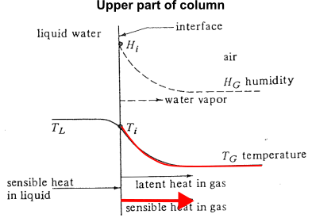
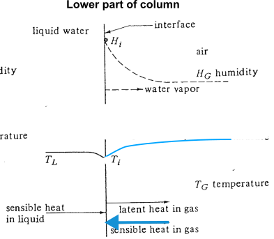
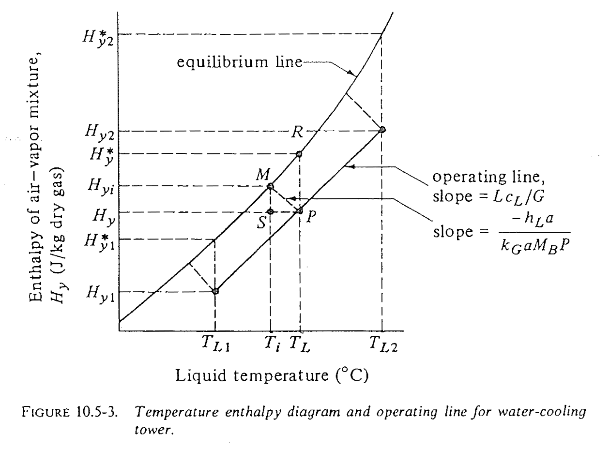

::: {.content-visible when-format="html" unless-format="revealjs"}

::: {.callout-note}
- Slides 👉  [Open presentation🗒️](./slides.html)
- PDF version of course note  👉 [Open in pdf](./L30.pdf)
- Handwritten notes 👉 [Open in pdf](../L29/public/L29-L32_annotated.pdf)
:::

:::


## Learning outcomes {.center}

After this lecture, you will be able to:

- **Recall** the core transport processes that occur in a cooling tower.
- **Describe** the enthalpy-temperature chart used for cooling-tower analysis.
- **Relate** cooling-tower design questions to the packed absorption framework.


## Cheatsheet for cooling tower


## Introduction to cooling tower

Chemical plants often use water cooling towers for heat exchange. What is the mechanism?


## Some other geometry of a cooling tower

The iconic hyperboloid structure seen at many power plants is also a
cooling tower

:::{.callout-note}

A [youtube video](https://www.youtube.com/watch?v=tmbZVmXyOXM) explains the mechanism of cooling tower in detail, with some analysis of the psychrometric chart. Highly recommended.

:::


## Common features of a cooling tower

:::{.columns}
::: {.column width="50%"}
- Warm water enters from the top
- (Cool) air enters from the bottom
- Cooler water leaves at the bottom
- More humid air leaves at the top
:::

::: {.column width="50%"}
{width="400px"}
:::
:::

## Why does cooling happen?

- Dry air promotes evaporation
- Evaporation consumes latent heat
- Latent heat is supplied mainly by the liquid water
- Therefore the water temperature drops

## Why does evaporation occur?

At the water surface, vapor tends to leave the liquid if the interface
vapor pressure is higher than that in the bulk gas.

Driving force for
evaporation:

```{=tex}
\begin{align} p_{\mathrm{vap}}(T_i) - p_A(T_w) > 0
\end{align}
```

Direction of mass transfer $N_A$: water to air (opposite from absorption tower)


## Cooling tower design steps

Similar to absorption tower design, cooling tower design can be broken
down into

- **Equilibrium state**: what is the equilibrium between water-gas, how to represent it?
- **Mass balance**: how to describe the operating line?
- **Flux equation**: how to express $N_A$ in gas phase?
- **Column height**: how to derive the differential equation and solve for desired tower height?

## Temperature - humidity relation in a cooling tower (1)

- In the **upper** part of the tower, temperature in liquid is hotter than bulk gas



## Temperature - humidity relation in a cooling tower (2)

- In the **lower** part of the tower, temperature in liquid is hotter than bulk gas




## Question 1: what is the equilibrium line?

For the cooling tower, we're interested in both **humidity of gas**
and **energy transfer** at interface. Instead of using just
psychrometric chart ($H$ vs $T$), a better choice is to plot the enthalpy
of gas phase $H_y$ vs the bulk temperature in liquid $T_L$.

## Cooling tower chart: how is it constructed?

- Chart: enthalpy $H_y$ vs bulk liquid temperature $T_L$
- Equilibrium line: $H_{yi}$ vs $T_{Li}$ at the interface
- From psychrometric chart 100% line

$$
H_y = c_s (T - T_0) + H \lambda_0 = (1.008 + 1.88H)T + 2501.4H
$$

## Meaning of the enthalpy - temperature chart

- What are points on the equilibrium line?
- Are we operating above or below the line? (What does it mean?)



## Summary

- Cooling towers cool water by coupling evaporation with heat transfer to the gas stream.
- The enthalpy-temperature chart provides a convenient way to represent equilibrium and operating behavior.
- Cooling-tower design follows the same broad structure as absorption analysis: equilibrium, balances, fluxes, and height.
