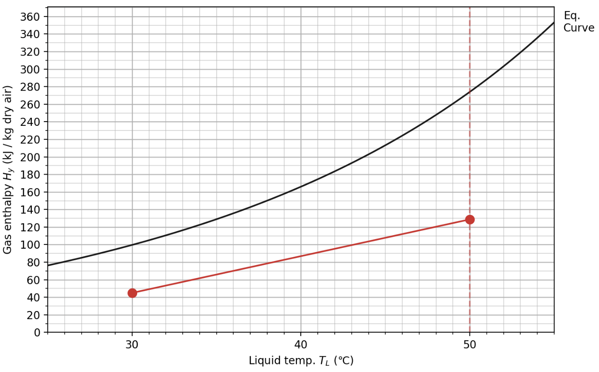
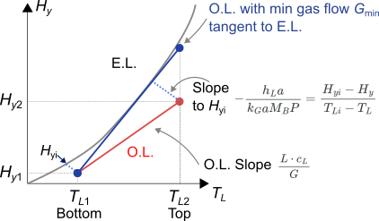

::: {.content-visible when-format="html" unless-format="revealjs"}

::: {.callout-note}
- Slides 👉  [Open presentation🗒️](./slides.html)
- PDF version of course note  👉 [Open in pdf](./L31.pdf)
- Handwritten notes 👉 [Open in pdf](./public/L31_annotated.pdf)
:::

:::


## Learning Outcomes {.center}

After today's lecture, you will be able to:

- Recall the process describing the evaporation process
- Analyze the enthalpy relation during evaporation
- Understand the origin of latent heat, wet-bulb temperature
- Recall steps to read the psychrometric chart on the adiabatic saturation curve

## Cheatsheet for Cooling Tower


## Recap: what do we solve for cooling tower?

For cooling tower, what are easy and hard to solve?

**Easy** (profile doesn't change shape)

- Gas phase humidity $H$
- Liquid phase temperature $T_L$

**Hard** (profile changes shape)

- Gas temperature $T_G$

## Recap: the enthalpy - temperature chart

For cooling system, we prefer to use **Gas Enthalpy** $H_y$ and
**Liquid Temperature** $T_L$ in a chart.



## Recap: what is the operating line?

Recall in the case of absorption packed-bed tower, we solved a mass
balance equation to describe operating line in the $x-y$ diagram. The
same applies to the cooling tower. An energy balance is used

```{=tex}
\begin{align}
\text{Energy}_{\text{In}} &= \text{Energy}_{\text{Out}} \\
G (H_{y2} - H_{y1}) &= L c_L (T_{L2} - T_{L1})
\end{align}
```

## Meaning of the mass balance & operating line

The operating line in cooling tower is just a **linear line** with expression

$$
G (H_y - H_{y1}) = L \cdot c_L (T_L - T_{L1})
$$

and a slope of $\frac{L \cdot c_L}{G}$. ($c_L \approx 4.18$ kJ / kg · K)


## Question 3: what is the minimal flow rate?

Similar to absorption tower, but since we're **below** the equilibrium
line 👉 use tangent construction to fine $G_{\text{min}}$



## Minimal flow rate demo

Also see assignment 8

```{=html}
<iframe width="100%" height="800"
		src="../../scripts/L31_enthalpy_chart.html" title="Webpage example"></iframe>
```

## Question 4: solving interfacial profile

Like absorption tower, we're again interested in solving the interfacial profile, in order to finally find the height of the tower. How did we achieve that in absorption tower?

Use a control volume from $z$ to $dz$, the mass balance for that region is

```{=tex}
\begin{align}
\text{Energy}_{\text{In}} &= \text{Energy}_{\text{Out}} \\
G dH_{y} &= L c_L dT_L
\end{align}
```

- L.H.S. contains $d H_y$: contribution from both sensible & latent heat
- R.H.S. contains $d T_L$: only sensible heat

## Heat transfer at interfaces (1)

To rewrite the R.H.S $L c_L dT_L$, we can use the liquid heat transfer coefficient $h_L a$

```{=tex}
\begin{align}
L c_L dT_L &= h_L a (T_L - T_{Li}) dz
\end{align}
```

- Sensible heat flux in liquid $q_{L,S}$: from liquid to gas
- $h_L a$ depends on the actual packing geometry!


## Heat transfer at interfaces (2)

The L.H.S. $G dH_{y}$ requires some attention, since such heat flux requires both sensible and latent heat fluxes $q_{G,S}$ and $q_{G,\lambda}$, respectively

```{=tex}
\begin{align}
G dH_y &= q_{G,S} + q_{G,\lambda} \\
       &= h_G a dz (T_i - T_G) + \lambda_0 a N_A M_A \\
       &= h_G a dz (T_i - T_G) + M_B \lambda_0 k_G a P dz (H_i - H_G)
\end{align}
```

- The derivation for $q_{G, \lambda}$ uses the fact $y \approx \frac{M_B}{M_A} H$
- Pressure-based coefficient $k_G a$ often used instead of $k_y a$

## Heat transfer at interfaces (3)

Since the evaporation at interface is similar to the adiabatic
process, the following relation (see [Lecture 29](../L29)) can be used:

$$
\frac{h_G a}{M_B k_y a} = \frac{h_G a}{M_B k_G P} \approx c_s
$$

which gives heat transfer in gas phase as

```{=tex}
\begin{align}
G dH_y &= c_s M_B k_G a P dz (T_i - T_G) + M_B \lambda_0 k_G a P dz (H_i - H_G) \\
       &= M_B k_G a P dz \left[ c_s (T_i - T_G) + \lambda_0 (H_i - H_G) \right] \\
       &= M_B k_G a P dz (H_{yi} - H_y)
\end{align}
```

## Heat transfer at interfaces (4)

What are the implications for the follong equation?

```{=tex}
\begin{align}
G dH_y &= M_B k_G a P dz (H_{yi} - H_y)
\end{align}
```

- The enthalpy in the gas phase $H_y$ has an associated "transfer coefficient" $M_B k_G a P$!
- That justifies our choice of Enthalpy - Temperature chart.
  - Enthalpy driving force in gas phase
  - Temperature driving force in liquid phase

## Interfacial flux equation for cooling tower

Combining the L.H.S with R.H.S we get

```{=tex}
\begin{align}
M_B k_G a P dz (H_{yi} - H_y) &= h_L a (T_L - T_{Li}) dz \\
\frac{H_{yi} - H_y}{T_{Li} - T_{L}} &= -\frac{h_L a }{M_B k_G a P }
\end{align}
```

- The slope to find interfacial $(H_{yi}, T_{Li})$ is $-\frac{h_L a }{M_B k_G a P }$
- No longer need to do iterative slope searching, only 1 calculation!

## Interfacial demo

```{=html}
<iframe width="100%" height="800"
		src="../../scripts/L31_enthalpy_chart.html" title="Webpage example"></iframe>
```