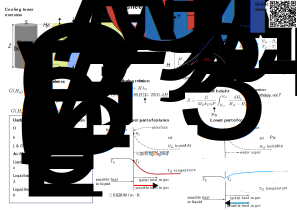
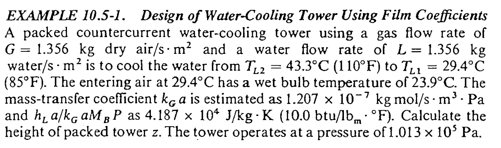
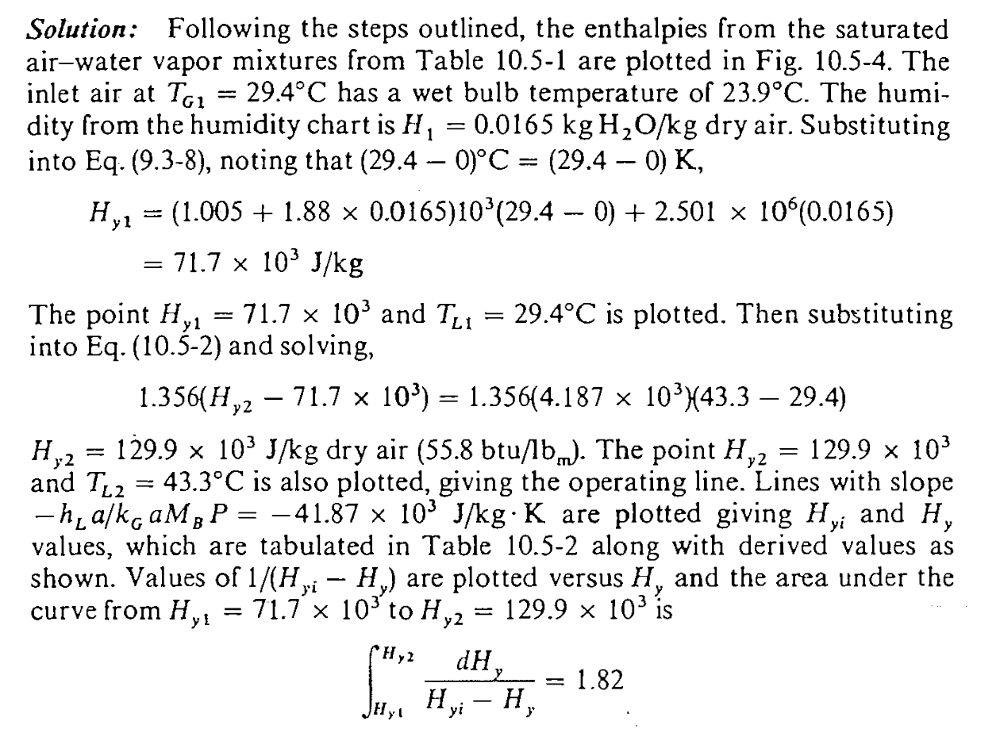
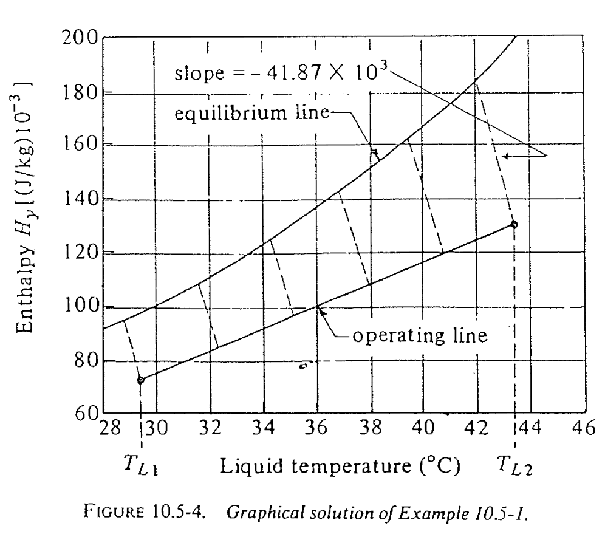
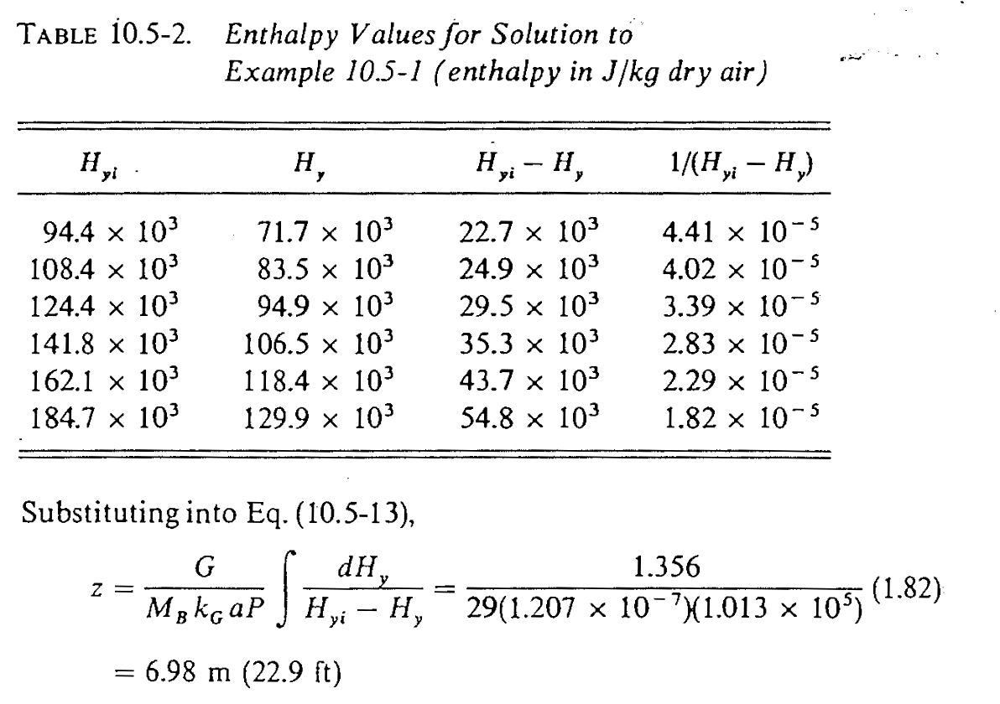

::: {.content-visible when-format="html" unless-format="revealjs"}

::: {.callout-note}
- Slides 👉  [Open presentation🗒️](./slides.html)
- PDF version of course note  👉 [Open in pdf](./L32.pdf)
- Handwritten notes 👉 [Open in pdf](../L29/public/L29-L32_annotated.pdf)
:::

:::


## Learning outcomes {.center}

After this lecture, you will be able to:

- **Recall** the form of the cooling-tower height equation from coupled heat- and mass-transfer balances.
- **Describe** interfacial enthalpy driving forces using the enthalpy-temperature chart.
- **Apply** the design procedure to estimate tower height for a representative cooling-tower problem.
- **Analyze** how the model can be extended to predict the bulk-gas temperature profile.

## Cheatsheet for cooling tower




## Recap: interfacial energy transfer

We wanted to solve the differential form

```{=tex}
\begin{align}
L c_L dT_L &= h_L a (T_L - T_{Li}) dz
\end{align}
```

- L.H.S.: sensible heat in liquid $L c_L dT_L = h_L a (T_L - T_{Li}) dz$
- R.H.S.: sensible + latent heat in gas

## Recap: solving the energy transfer in gas-phase

For the latent heat $q_{G, \lambda}$, it is solved by

```{=tex}
\begin{align}
q_{G, \lambda} &= M_A N_A \lambda_0 \\
               &= M_A k_y a dz (y_i - y) \lambda_0 \\
	       &\approx M_A k_G a P dz \frac{M_B}{M_A}(H_i - H) \lambda_0 \\
	       &= M_B \lambda_0 k_G a P dz (H_i - H_G)
\end{align}
```

- The derivation for $q_{G, \lambda}$ uses the fact $y \approx \frac{M_B}{M_A} H$
- Pressure-based coefficient $k_G a$ often used instead of $k_y a$

## Energy transfer in liquid: final results

Adding the sensible & latent heat in liquid side gives

```{=tex}
\begin{align}
G dH_y &= q_{G,S} + q_{G,\lambda} \\
       &= h_G a dz (T_i - T_G) + \lambda_0 a N_A M_A \\
       &= h_G a dz (T_i - T_G) + M_B \lambda_0 k_G a P dz (H_i - H_G)
\end{align}
```

As can be expected, both temperature and humidity driving forces should exhist.

## Energy transfer in liquid: adiabatic process

Since the evaporation at interface is similar to the adiabatic
process, the following relation (see [Lecture 29](../L29)) can be used:

$$
\frac{h_G a}{M_B k_y a} = \frac{h_G a}{M_B k_G P} \approx c_s
$$

which gives heat transfer in gas phase as

```{=tex}
\begin{align}
G dH_y &= c_s M_B k_G a P dz (T_i - T_G) + M_B \lambda_0 k_G a P dz (H_i - H_G) \\
       &= M_B k_G a P dz \left[ c_s (T_i - T_G) + \lambda_0 (H_i - H_G) \right] \\
       &= M_B k_G a P dz (H_{yi} - H_y)
\end{align}
```

## Heat transfer at interfaces: implications

What are the implications for the follong equation?

```{=tex}
\begin{align}
G dH_y &= M_B k_G a P dz (H_{yi} - H_y)
\end{align}
```

- The enthalpy in the gas phase $H_y$ has an associated "transfer coefficient" $M_B k_G a P$!
- That justifies our choice of Enthalpy - Temperature chart.
  - **Enthalpy driving force** in gas phase
  - **Temperature driving force** in liquid phase

## Interfacial flux equation for cooling tower

Combining the L.H.S with R.H.S we get

```{=tex}
\begin{align}
M_B k_G a P dz (H_{yi} - H_y) &= h_L a (T_L - T_{Li}) dz \\
\frac{H_{yi} - H_y}{T_{Li} - T_{L}} &= -\frac{h_L a }{M_B k_G a P}
\end{align}
```

- The slope to find interfacial $(H_{yi}, T_{Li})$ is $-\frac{h_L a }{M_B k_G a P}$
- No longer need to do iterative slope searching, only 1 calculation!

## Link to humidity chart adiabatic saturation curves

Recall in [Lecture 29](../L29), the slope of adiabatic curves in
psychrometric chart is given by

$$
\frac{H_w - H}{T_w - T} = - \frac{h_G}{M_B k_y \lambda_w}
$$

On the other hand the slope to find interfacial $(H_{yi}, T_{Li})$ in cooling tower is

$$
\frac{H_{yi} - H_y}{T_{Li} - T_{L}} = -\frac{h_L a }{M_B k_G a P}
$$

They have very similar forms, but be careful one is purely in gas phase and the other describes the 2-phase equilibrium.

## Solving the tower height

If only use the R.H.S result

```{=tex}
\begin{align}
G dH_y &= M_B k_G a P dz (H_{yi} - H_y)
\end{align}
```

we can obtain the total tower height by integration

```{=tex}
\begin{align}
Z &= \int_{0}^{Z} dz \\
  &= \int_{H_{y1}}^{H_{y2}} \frac{G}{M_B k_G a P} \frac{dH_y}{H_{yi} - H_y}
\end{align}
```

:::{.callout-warning}
The integral is carried out over $d H_y$, not $T_L$!
:::

## Steps to solve the cooling tower

Similar to absorption tower, cooling tower design typically involves the following steps

1. Plot the saturated air enthalpy $H_{yi}$ vs liquid temperature $T_L$ (usually a given chart)
2. Knowing the entering air conditions $T_{G1}$ and $H_1$ (humidity), calculate the enthlpy $H_{y1}$ (not saturated).
3. The tower bottom $(T_{L1}, H_{y1})$ on the operating line is determined from $T_{L1}$ requirement
4. Find the minimal gas flow rate $G_{min}$ and practical operating $G$, determine tower top operating line point $(T_{L2}, H_{y2})$
5. Know the $h_L a$ and $k_G a P$ (or $k_y a$) values, pick several points along the operating line, use slope $-\frac{h_L a }{M_B k_G a P}$ to find $H_{yi}$ and calculate $1 / (H_{yi} - H_y)$
6. Numerically integrate $\int_{H_{y1}}^{H_{y2}} 1 / (H_{yi} - H_y) dH_y$ and $\frac{G}{M_B k_G a P}$ to find $Z$

## Cooling tower design problem example



:::{.callout-note}
A similar example is given in Assignment 8. Be careful about the units!
:::

## Finding the humidity of inlet air

```{=html}
<iframe width="100%" height="800"
		src="../../scripts/L29_psychrometric.html" title="Webpage example"></iframe>
```

## Interfacial demo

```{=html}
<iframe width="100%" height="800"
		src="../../scripts/L31_enthalpy_chart.html" title="Webpage example"></iframe>
```

## Textbook solution (1)



## Textbook solution (2)



## Textbook solution (3)

We get $Z = 7.03$ m, pretty close!



## Final question: what if we wanted to know the $T_G$ as well?

:::{:callout-note}
Advanced discussion. May not appear in final exam.
:::

For the change of bulk-gas temperature $T_G$, the following energy
flux equation can be given for the sensible heat in gas $q_{G, S}$:

```{=tex}
\begin{align}
c_s G dT_G &= h_G a dz (T_{Gi} - T_{G}) \\
           &= h_G a dz (T_{Li} - T_{G})
\end{align}
```

For comparison we also have the change of bulk liquid temperature expressed as 

```{=tex}
\begin{align}
c_L L dT_L &= M_B k_G a P  dz (H_{yi} - H_{y})
\end{align}
```

Our goal is to find a differential equation so that $T_G$ can be
integrated from $T_{G1}$ (cool air intake)


## Solving the ODE for $T_G$

Combine the energy balance equations for $T_G$ and $T_L$ gives

```{=tex}
\begin{align}
\frac{c_L L}{c_s G} \frac{dT_L}{dT_G} &= \frac{M_B k_G a P}{h_G a} \frac{H_{yi} - H_{y}}{T_{Li} - T_G} \\
d T_G &= \frac{c_L L}{G} \frac{T_{Li} - T_G}{H_{yi} - H_{y}} d T_L
\end{align}
```

- Again, we cancel out $c_S = \frac{h_G a}{M_B k_G a P}$.  This is an
- integrable ODE, given that at any $(T_L, H_y)$, we can calculate $H_{yi}$ without needing $T_G$

## Integrating $T_G$: graphical explanation

```{=html}
<iframe width="100%" height="800"
		src="../../scripts/L31_enthalpy_chart_full.html" title="Webpage example"></iframe>
```


## Summary

- Cooling-tower height can be obtained by integrating the interfacial enthalpy driving force across the column.
- The enthalpy-temperature chart provides the graphical information needed to evaluate interfacial states.
- The same framework can be extended to estimate the bulk-gas temperature profile when needed.
