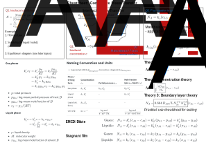

::: {.content-visible when-format="html" unless-format="revealjs"}

::: {.callout-note}
- Slides 👉  [Open presentation🗒️](./slides.html)
- PDF version of course note  👉 [Open in pdf](./L33.pdf)
:::

:::

## Learning outcome {.center}

This is a review lecture for preparing for the final exam, focusing on
the concept sheets from pre-midterm.

## Cheatsheet for pre-midterm mass transfer

](./public/cheatsheet-premidterm.svg)

## Cheatsheet for convective mass transfer & coefficients

](./public/cheatsheet-coeff.svg)

 